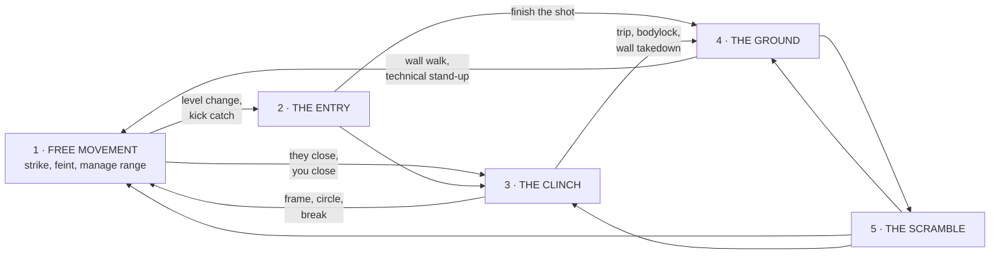

# The Complete MMA Curriculum — 24 Weeks, 120 Sessions

> 24 weeks · 5 sessions/week · 90 minutes/session · **120 numbered sessions**, every one written out block by block.
> This is the whole sport: striking, wrestling, clinch, cage, ground, ground-and-pound, submissions, defense in every phase, fight IQ, weight, conditioning and fight week.

**Companion documents**

| File | What it is |
|---|---|
| **[training-plan.md](training-plan.md)** | The 8-week grappling-only camp (32 sessions). Deeper on jiu-jitsu, narrower on the sport. |
| **[jujitsu.md](jujitsu.md)** | The ground-technique dictionary — every position, sweep, pass and submission, rated. |
| **[techniques/](techniques/)** | Per-technique manuals: mechanism, body-size adjustments, failure modes, defense. |

Where this file says *drill the D'Arce* or *escape side control*, the detail page in
[techniques/](techniques/) is the manual. This file is the **calendar**: what you do,
on which day, for how many minutes, at what intensity.

---

## Who this is for

A complete beginner can start at Session 001 and arrive at Session 120 as a fighter
ready for an amateur bout. An experienced grappler or striker runs the same calendar
and uses their strong phase's sessions as sharpening and their weak phase's sessions
as school. Nobody skips the phase they are bad at — that phase is where your fight
will be decided.

## The five phases of a fight

Every second of an MMA fight is in exactly one of these, and every skill in this
curriculum belongs to a phase or to a shift between phases.

| # | Phase | Range | Who wins it |
|:-:|---|---|---|
| **1** | **Free movement** | Kicking and punching range, nobody attached | Footwork, feints, the person dictating range |
| **2** | **The entry** | The half-second of a shot, a kick catch, a clinch attempt | Whoever's level change is hidden |
| **3** | **The clinch** | Attached, standing — collar, underhooks, cage | Underhooks, head position, hips |
| **4** | **The ground** | Somebody's back is down | Position first, then strikes, then submissions |
| **5** | **The scramble** | Nobody's position is settled | The one who already decided where they're going |

**The curriculum's whole thesis:** amateurs train phases, fighters train the arrows
between them. Every Thursday in this calendar is an arrow.

## The six blocks

| Weeks | Sessions | Block | Goal |
|---|---|---|---|
| 1–4 | 001–020 | **FOUNDATION** | Stance, footwork, the first six strikes, the first three takedowns, ground survival. Nothing fancy, everything sound. |
| 5–8 | 021–040 | **CLINCH & CAGE** | The phase that decides most fights and gets the least training: underhooks, plum, knees, elbows, wall wrestling, wall escapes. |
| 9–12 | 041–060 | **GROUND & FINISH** | Pass, hold, hit, submit — and everything the bottom fighter does about it. |
| 13–16 | 061–080 | **PHASE SHIFTS** | The arrows. Strike-to-shot, shot-to-strike, get-ups, scrambles, counters to all of it. |
| 17–20 | 081–100 | **SYSTEMS & GAME PLAN** | Style matchups, southpaw problems, your A-game, round management, judging, adversity. |
| 21–24 | 101–120 | **FIGHT CAMP** | Hard rounds, fight sims, the weight cut, the taper, fight week, the final exam. |

## The 90-minute session clocks

Five session types, one per training day. Every session in this document names its
type and follows that type's clock exactly.

### Type S — Striking (Mondays)

| Minutes | Block |
|---|---|
| 0–10 | Warm-up: skipping, shadow boxing, mobility |
| 10–25 | **Technique** — the day's new tool, on air then on pads |
| 25–40 | **Development** — that tool inside combinations |
| 40–55 | **Defense & counter** — the answer to the thing you just learned |
| 55–70 | **Pads & bag** — rounds at working pace |
| 70–85 | **Constrained sparring** — the day's rule set |
| 85–90 | Log: one win, one fix |

### Type W — Wrestling & Clinch (Tuesdays)

| Minutes | Block |
|---|---|
| 0–10 | Warm-up: stance, level changes, sprawls, penetration steps |
| 10–25 | **Entry** — how you get to today's attack |
| 25–45 | **The skill** — the takedown, clinch position or defense of the day |
| 45–60 | **Finishes & counters** — three finishes, and what they do about it |
| 60–75 | **Cage** — the same skill against the fence |
| 75–88 | **Live wrestling** — takedown-only rounds |
| 88–90 | Log |

### Type G — Ground (Wednesdays)

| Minutes | Block |
|---|---|
| 0–10 | Warm-up: shrimps, bridges, technical stand-ups, sit-outs |
| 10–25 | **Position** — hold it or escape it, no strikes yet |
| 25–45 | **System** — the attacks or escapes that live there |
| 45–60 | **Strikes layered in** — the same position with gloves on |
| 60–75 | **Submission chain** |
| 75–88 | **Positional live** |
| 88–90 | Log |

### Type M — MMA Integration (Thursdays)

| Minutes | Block |
|---|---|
| 0–10 | Warm-up: shadow MMA — strike, shoot, sprawl, get up |
| 10–25 | **Shift A** — striking into grappling |
| 25–40 | **Shift B** — grappling back into striking |
| 40–55 | **Cage segment** — the same shifts with a fence |
| 55–75 | **MMA rounds** — all phases live at the week's intensity |
| 75–88 | **Situational restarts** — coach calls the position, 60-second problems |
| 88–90 | Log |

### Type L — Sparring & Engine (Fridays)

| Minutes | Block |
|---|---|
| 0–12 | Warm-up and mobility |
| 12–20 | **Primer** — the week's one cue, rehearsed cold |
| 20–50 | **Sparring** — the week's format and intensity |
| 50–65 | **Conditioning** — the block's energy system |
| 65–80 | **Strength or recovery** — see the [S&C appendix](#appendix-a--strength--conditioning) |
| 80–90 | Cool-down, breathing, log |

**The optional sixth day:** Saturday open mat or a long easy aerobic session. Sunday
is off — not "light," off. The calendar assumes you take it.

## Intensity and contact rules

The single most common way to ruin a fighter is to spar hard, often, with no ladder.
This curriculum has a ladder, and it is not negotiable.

| Weeks | Head contact | Body/legs | Takedowns | Submissions |
|---|---|---|---|---|
| 1–4 | **None** — touch only, gloves on | Light | Drilled, not live-finished | Catch-and-release, no cranking |
| 5–8 | Light (30%), controlled | Moderate | Live to the mat on pads | Catch-and-release |
| 9–12 | Light (30%) | Moderate | Live | Live, slow — tap early |
| 13–16 | Medium (50%) on integration days only | Moderate | Live | Live |
| 17–20 | Medium (50%), one hard round/week max | Moderate–hard | Live | Live |
| 21–23 | Hard rounds twice a week, capped | Hard | Live | Live |
| 24 | **Taper — light only** | Light | Light | Flow |

**Non-negotiables, all 24 weeks**

- **Tap early, tap often.** A tap is data, not a defeat.
- **No live heel hooks.** Defense concepts at drill speed only ([training-plan.md](training-plan.md) covers the same rule).
- **Mouthpiece for anything with contact.** Cup, shin guards and 16 oz gloves for sparring.
- **No knees or elbows to a downed head in sparring, ever** — even where a ruleset allows them, your training partner is not a ruleset.
- **Head-contact sparring never on back-to-back days**, and never within 48 hours of a concussion symptom. Symptoms end the week, not the round.
- **Throws land on crash pads.** Mat returns, never spikes.
- **Everything catch-and-release** on chokes: the tap is the finish line.

## How to read a session

Each session is one block of bullets, timestamped to its type's clock. A session
looks like this:

> ### Session 000 — Example Day *(Type S — Striking)*
> - **0–10 Warm-up:** what to do.
> - **10–25 Technique:** the new tool, with the two details that make it work.
> - …
> - **Coach cue:** *the one sentence you say out loud when it goes wrong.*

Sessions marked **★** are checkpoint sessions: you are being tested, and the block
does not end until you pass.

---

# BLOCK 1 · Weeks 1–4 — FOUNDATION

You cannot fight out of a bad stance, and you cannot learn anything else while you
are drowning on the bottom. This block buys you a stance that works in all five
phases, six strikes you can throw without thinking, three takedowns, and the
ability to survive on the ground long enough to learn the rest of the sport.

**Contact this block: none to the head.** Touch sparring only. This is not being
careful, it is being efficient — you cannot learn while you are defending.

## Week 1 — First contact

The MMA stance is a compromise between a boxer's stance and a wrestler's, and every
beginner's first month is spent finding it.

### Session 001 — Stance, Guard, Step *(Type S — Striking)*

- **0–10 Warm-up:** Skip 3×2 min, ankle and hip circles, shadow with hands down just moving.
- **10–25 Technique:** The MMA stance — feet slightly wider and squarer than boxing, weight 50/50, lead toe and rear heel on one line, knees soft, hands high with elbows in front of the ribs. Square enough to sprawl, bladed enough not to be kicked in the belly.
- **25–40 Development:** Footwork — push-step forward, drag-step back, lateral steps, pivot on the lead foot. Never cross the feet, never bounce. Mirror your partner around the mat for 5 minutes without touching.
- **40–55 Defense & counter:** The jab: lead shoulder to chin, hand returns on the same line, rear hand glued to the cheek. Ten sets of five on the pads, both as a range-finder and as a hard punch.
- **55–70 Pads & bag:** 4×3 min bag: jab only, moving. Change level once per round for no reason at all — start the habit today.
- **70–85 Constrained sparring:** Jab-only touch sparring, 4×2 min, open hands, headgear optional. Score by who controls the distance, not who lands.
- **Coach cue:** *If you can't sprawl from your stance, it isn't an MMA stance.*

### Session 002 — Shots and Sprawls *(Type W — Wrestling & Clinch)*

- **0–10 Warm-up:** Stance-and-motion down the mat, 30 level changes with the knees (never the waist), 20 sprawls on the whistle.
- **10–25 Entry:** Level change mechanics: drop the hips, chest stays vertical, eyes up. The head never dips below the shoulders — a dipping head is a guillotine and a knee.
- **25–45 The skill:** The penetration step — lead knee inside their stance and to the mat, trail leg swings through, head up and outside their hip. 10 clean reps each side, no partner, then 10 on a standing partner.
- **45–60 Finishes & counters:** The sprawl: hips punch the mat, legs fire back, chest heavy on the shoulder blades, then circle to the side. Partner shoots at 30%; you sprawl and take an angle.
- **60–75 Cage:** Same two skills against the wall — shoot with your back to open mat, sprawl with your hips off the fence. First lesson of the cage: it helps whoever's hips are further from it.
- **75–88 Live wrestling:** Alternating 30-second shot-or-sprawl rounds at 50%. No finishing the takedown yet; a leg captured counts.
- **Coach cue:** *Change level with your knees, or you'll learn it with your neck.*

### Session 003 — The Ladder and the Bottom *(Type G — Ground)*

- **0–10 Warm-up:** Shrimps and bridges down the mat, technical stand-ups, forward and backward rolls.
- **10–25 Position:** The positional ladder — back, mount, side control, half guard, neutral, guard bottom, bottom side, bottom mount, back taken. Rank it out loud; you will make decisions off this list for the rest of your career. See the same ladder in [training-plan.md](training-plan.md#the-positional-ladder).
- **25–45 System:** Two escapes, both sides: mount trap-and-roll (trap arm and same-side foot, bridge over that shoulder), and the side control shrimp (forearm frame at the neck, elbow to knee, knee in, recover guard). Nothing else this session.
- **45–60 Strikes layered in:** None yet. Instead: the survival posture under a top opponent — elbows inside their knees, one arm framing, hips always angled, never flat on your back.
- **60–75 Submission chain:** None. Spend it on the technical stand-up from guard bottom, 20 reps, and on staying connected to a partner walking around you.
- **75–88 Positional live:** 5×2 min starting mounted and under side control. Escape resets; the top player only holds.
- **Coach cue:** *Flat is finished — always be on a hip.*

### Session 004 — Four Ranges *(Type M — MMA Integration)*

- **0–10 Warm-up:** Shadow MMA: three strikes, a level change, a sprawl, a stand-up, repeat for 8 minutes.
- **10–25 Shift A:** Range recognition drill. Partner holds a stance; on the coach's call you step to kicking range, punching range, clinch range, or attach. Learn what each range feels like in your legs before you learn what to do in it.
- **25–40 Shift B:** Ground back to standing — from guard bottom and from turtle, get up and re-establish your stance facing them. 15 reps each, partner resisting at 30%.
- **40–55 Cage segment:** Walk the fence: back to the cage, feel how the stance dies there, and practise circling out along the wall before anybody touches you.
- **55–75 MMA rounds:** 5×3 min "phase tag" — start standing at jab-touch intensity; either fighter may shoot; whoever gets a takedown holds for 10 seconds and both reset standing. No strikes on the ground.
- **75–88 Situational restarts:** 60-second problems: your back to the cage · flat on your back with a partner in your guard · both of you neutral in a collar tie.
- **Coach cue:** *You are always in a range. Know which one, or you're in theirs.*

### Session 005 — Baseline *(Type L — Sparring & Engine)*

- **0–12 Warm-up:** Skip, mobility, shadow at 50%.
- **12–20 Primer:** Stance check under fatigue — 2 minutes of continuous footwork while a partner calls direction changes.
- **20–50 Sparring:** Touch sparring 6×3 min, jab and footwork only, no head contact. Rotate partners every round.
- **50–65 Conditioning:** Aerobic baseline test — 20-minute continuous effort (run, row, bike, or shadow-and-bag) at a pace where you can still speak. Write down the distance or rounds; you retest at Sessions 060 and 120.
- **65–80 Strength:** Introduction to the Block 1 lift: goblet squat, hinge pattern, push-up, row, farmer carry. Three sets each, technique only, nothing heavy.
- **80–90 Cool-down:** Nasal breathing, 5 minutes; log your baseline numbers.
- **Coach cue:** *The engine is the skill you can always improve.*

> **CHECKPOINT W1 — Hold a correct stance under 3 minutes of footwork; ten clean penetration steps and ten sprawls; escape mount and side control against a non-resisting partner.**

## Week 2 — Straight lines

The rear straight is the most-landed power punch in MMA and the level change that
hides behind it is the sport's most-used takedown entry. This week they are the
same movement.

### Session 006 — The Cross and the Answer *(Type S — Striking)*

- **0–10 Warm-up:** Skip, shadow with the jab from Session 001.
- **10–25 Technique:** The cross — rear heel turns, hip drives, shoulder finishes on the chin, hand comes back the way it went. Elbow never flares; a flared elbow gets caught under an overhook in the clinch.
- **25–40 Development:** 1–2, 1–1–2, 2–3 (cross to lead hook) on the pads, stepping with each punch. Every combination ends with your feet under you and your stance rebuilt.
- **40–55 Defense & counter:** Catch the jab with the rear palm, parry the cross with the lead, and the pull-counter: shift the weight back an inch, return the cross over the top. Partner drill at 25%, hands open.
- **55–70 Pads & bag:** 5×3 min: two rounds pads on the 1–2, three rounds bag with a level change after every combination.
- **70–85 Constrained sparring:** Straight punches only, light body contact, touch to the head. 5×2 min.
- **Coach cue:** *Punch and re-stance — the second half of a combination is your feet.*

### Session 007 — Double Leg *(Type W — Wrestling & Clinch)*

- **0–10 Warm-up:** Level change ladder, 20 penetration steps, partner-carried sprawls.
- **10–25 Entry:** Two setups: off a collar tie snap, and off the jab (throw it long so they lean back, then shoot the second one at their hips).
- **25–45 The skill:** The double leg — head outside, ear on the ribs, both hands cupped behind the knees, hips in under theirs. Three finishes: **drive** through the far side, **lift** with a hip pop, **cut the corner** by stepping around the near leg.
- **45–60 Finishes & counters:** Their answers — sprawl, whizzer, down block, head hand-fight. Take one rep of each so you know what failure feels like before it happens live.
- **60–75 Cage:** The stuffed double against the fence: hips stay low, drop to one knee, wall-drive, and switch to a single if the double dies. The wall replaces the second leg.
- **75–88 Live wrestling:** Takedown-only rounds, 5×2 min, no strikes, 60% resistance.
- **Coach cue:** *The head decides the takedown — outside for the double, inside for the single.*

### Session 008 — Guard Bottom Is Not a Bed *(Type G — Ground)*

- **0–10 Warm-up:** Hip escapes, bridge-and-shrimp combinations, sit-outs.
- **10–25 Position:** Closed guard bottom in MMA: break the posture, angle the hips, control a wrist and the head. A tall opponent in your guard is a rain of punches; a broken-posture opponent is safe.
- **25–45 System:** Three exits: hip-bump sweep, technical stand-up to your feet, and the scissor sweep. Bottom guard has one law — sweep, submit or stand, never lie there.
- **45–60 Strikes layered in:** Gloves on, top partner places open-hand shots at 10% while you break posture. Notice which grips make the strikes stop.
- **60–75 Submission chain:** Kimura off the hip bump — when they post the hand you were going to sweep over, take the arm instead. See [techniques/submissions/kimura.md](techniques/submissions/kimura.md).
- **75–88 Positional live:** Guard battle 5×2 min: bottom sweeps, submits or stands; top passes or postures.
- **Coach cue:** *Nothing works from a flat back and a straight-armed opponent.*

### Session 009 — Hands Into Hips *(Type M — MMA Integration)*

- **0–10 Warm-up:** Shadow MMA with a level change after every third punch.
- **10–25 Shift A:** The 1–2 to double leg: the cross lands, the rear hand comes back, and the level change rides that same weight transfer. Their hands are high because you made them high.
- **25–40 Shift B:** Their sprawl becomes your problem: hips down, hands fighting to the front headlock, then re-stand and re-stance without eating the knee.
- **40–55 Cage segment:** Punch them to the fence, then shoot — the cage takes away the sprawl-back. Ten entries each.
- **55–75 MMA rounds:** 5×3 min: strikes touch-only, takedowns live, 10 seconds of top control, reset standing.
- **75–88 Situational restarts:** Start in a stuffed shot (front headlock on you) · start with a takedown half-finished.
- **Coach cue:** *Shoot at the reaction, not at the man.*

### Session 010 — Feet and Lungs *(Type L — Sparring & Engine)*

- **0–12 Warm-up:** Mobility, shadow, 30 sprawls.
- **12–20 Primer:** 2 minutes of the 1–2-to-shot on air, at speed.
- **20–50 Sparring:** Boxing-only sparring 6×3 min, light body, touch head. Then 2×3 min wrestling-only.
- **50–65 Conditioning:** Aerobic intervals — 6×3 min at a hard-but-controlled pace with 1 min walking. This block builds the base; power comes later.
- **65–80 Strength:** Block 1 lift, 3×8 each pattern, moderate load.
- **80–90 Cool-down:** Long exhales, hip and shoulder stretch, log.
- **Coach cue:** *Tired is when technique either shows up or doesn't exist.*

> **CHECKPOINT W2 — Land a double leg on a 60% partner; throw a 1–2 that ends in a rebuilt stance; three minutes of guard bottom without going flat.**

## Week 3 — Legs and backs

Kicks are the longest weapon in the sport and the easiest way to end up on your
back. This week you learn to throw them, catch them, and check them.

### Session 011 — Kicking Range *(Type S — Striking)*

- **0–10 Warm-up:** Skip, hip openers, shadow with knees and teeps.
- **10–25 Technique:** The teep (push kick) — knee up first, foot drives through the hip or belly, land back in stance. Both legs. It is a range weapon, not a power shot.
- **25–40 Development:** The low kick — step out at 45°, turn the hips over, shin lands on the thigh, arm swings through. Rear low kick 20 each side on pads, lead low kick 20 each side.
- **40–55 Defense & counter:** Checking — knee up, shin turned out, weight stays on the standing leg. Then counters: catch the teep and step in, and answer the low kick with a rear cross as it lands.
- **55–70 Pads & bag:** 5×3 min: 1–2-low kick, teep-cross, and a round of nothing but checking a partner's low kicks.
- **70–85 Constrained sparring:** Kicks and jab only, 5×2 min, no head kicks, light legs.
- **Coach cue:** *Every kick you throw is a takedown you handed them — land in stance.*

### Session 012 — Single Leg *(Type W — Wrestling & Clinch)*

- **0–10 Warm-up:** Level changes, penetration steps, partner sprawls.
- **10–25 Entry:** Collar tie snap and the reach: head inside on the chest, their leg lifted to your hip, elbows locked around it.
- **25–45 The skill:** Three finishes — **run the pipe** (turn the corner, drive the shoulder), **inside trip** (their planted leg blocked), **high crotch to double** (change your head to the outside as they whizzer).
- **45–60 Finishes & counters:** The whizzer — deep overhook, hips down and back, square up and re-pummel. Then the limp-leg escape.
- **60–75 Cage:** Run-the-pipe against the fence, where they cannot circle away from you. Twelve reps each.
- **75–88 Live wrestling:** 5×2 min single-leg-only rounds at 60%.
- **Coach cue:** *A single leg you don't finish in three seconds is a scramble you're losing.*

### Session 013 — The Back *(Type G — Ground)*

- **0–10 Warm-up:** Seat-belt pummels, hook retention, bridges.
- **10–25 Position:** Back control — seat belt over one shoulder and under the far arm, hooks in or body triangle, chest glued, head off the centre line.
- **25–45 System:** The rear-naked choke, both sides: arm past the chin, elbow under the jaw, second hand behind the head, squeeze chest to spine. Then the escape: chin down, two hands on the choking hand, shoulders to the mat, walk the hips, clear the hook. See [techniques/escapes/back-escapes.md](techniques/escapes/back-escapes.md).
- **45–60 Strikes layered in:** Back control with gloves — the top player punches the side of the head at 10%, and the bottom player learns why hand-fighting beats turning.
- **60–75 Submission chain:** RNC to body triangle to RNC. Catch-and-release only.
- **75–88 Positional live:** Back attack vs escape, 5×2 min, both roles.
- **Coach cue:** *Legs keep the position; hands take the neck.*

### Session 014 — Catching Kicks *(Type M — MMA Integration)*

- **0–10 Warm-up:** Shadow MMA with kicks; sprawl on every third rep.
- **10–25 Shift A:** Catch the body kick — elbow down, trap it to the ribs, step to the outside and run them down into a single leg. Fifteen each side.
- **25–40 Shift B:** Your kick gets caught: hop, turn the hip over, kick the trapped leg free, or sit to guard on purpose instead of being dumped.
- **40–55 Cage segment:** Catch and walk them to the fence, then finish with a wall single. The fence is where caught kicks are cashed.
- **55–75 MMA rounds:** 5×3 min, kicks and takedowns live, hands touch-only, ground held for 15 seconds and reset.
- **75–88 Situational restarts:** They have your leg · you have theirs · you are sitting after a caught kick.
- **Coach cue:** *A caught leg is a takedown with a receipt — cash it before they hop free.*

### Session 015 — Kickboxing Rounds *(Type L — Sparring & Engine)*

- **0–12 Warm-up:** Skip, mobility, shadow with legs.
- **12–20 Primer:** Check-and-return: 20 checked kicks answered with a cross.
- **20–50 Sparring:** Kickboxing sparring 6×3 min — light legs and body, touch head, shin guards on. Then 2×3 min takedown-only.
- **50–65 Conditioning:** Tempo intervals — 10×1 min hard, 1 min easy. Breathe through the nose on the easy minute.
- **65–80 Strength:** Block 1 lift, 4×6, heavier. Add a hip-hinge single-leg movement.
- **80–90 Cool-down:** Calves, hips, thoracic spine, log.
- **Coach cue:** *Light legs today buys you sparring partners in week twenty.*

> **CHECKPOINT W3 — Check three low kicks in one round; finish a single leg on a 60% partner; escape the back or survive two minutes there.**

## Week 4 — Under fire

Everything you have learned, now with somebody hitting you a little, and a first
look at where fights actually go: the fence and the top position.

### Session 016 — Hooks, Body Kicks, Slips *(Type S — Striking)*

- **0–10 Warm-up:** Skip, shadow, neck and shoulder mobility.
- **10–25 Technique:** The lead hook — elbow at shoulder height, weight shifts to the rear foot, turn on the lead toe. Then the rear body kick: step out, turn through, shin above the hip line.
- **25–40 Development:** 1–2–3, 2–3–body kick, and the low kick–hook pair. Every combination changes level or angle once.
- **40–55 Defense & counter:** The slip and the roll — slip outside the jab, roll under the hook, and never move your head straight back. Partner throws at 25% with open hands; you slip and touch.
- **55–70 Pads & bag:** 5×3 min with a slip built into every round.
- **70–85 Constrained sparring:** Full hands, light body, head touch only, 5×2 min. Add legs in the last two rounds.
- **Coach cue:** *Your head has to leave the line it was on — every time, not most times.*

### Session 017 — Sprawl to Front Headlock *(Type W — Wrestling & Clinch)*

- **0–10 Warm-up:** Sprawl ladder, snap-down footwork, chin-strap pummels.
- **10–25 Entry:** The snap-down: heavy collar tie plus elbow control, snap as they step in, and meet their head with your chest.
- **25–45 The skill:** The front headlock — chin strap deep under the jaw, second hand on the elbow, chest on the crown, knee blocking the near shoulder. This is MMA's most valuable standing position, because everything leaves from it.
- **45–60 Finishes & counters:** The go-behind: shuck the head past you, drag the elbow, arrive at a 90° angle on their back. Their answer: hand to the throat, circle, re-wrestle.
- **60–75 Cage:** Snap them into the fence and ride the front headlock there. Note that they cannot back out — the wall is holding them still for you.
- **75–88 Live wrestling:** Front-headlock-only rounds: escape or go behind, 5×2 min.
- **Coach cue:** *Chin strap first — the choke is a later problem.*

### Session 018 — Top and Bottom Under Punches *(Type G — Ground)*

- **0–10 Warm-up:** Shrimping, hip switching, technical stand-ups.
- **10–25 Position:** Top control in MMA — side control and mount held with the head, not the hands. If both your hands are gripping, neither one is punching.
- **25–45 System:** Ground-and-pound 101 from mount and top half: base first, post the head, short elbows and hammer fists. Never let your weight come off them to punch.
- **45–60 Strikes layered in:** The bottom answer — the punch-block series: high frame on the biceps, hips escaping, knees in, pull the punching arm across to kill the second shot.
- **60–75 Submission chain:** Their arm crosses the centre line while punching from bottom — take the arm triangle from mount. Slow squeeze, catch-and-release.
- **75–88 Positional live:** 5×2 min: top may strike at 20%, bottom escapes, sweeps or stands.
- **Coach cue:** *Position pays for the punches — never buy a punch with your position.*

### Session 019 — The Fence *(Type M — MMA Integration)*

- **0–10 Warm-up:** Shadow MMA against the cage, 8 minutes.
- **10–25 Shift A:** Strike them to the fence: cut the angle with the jab, take away the circle, then bodylock or shoot with the wall behind them.
- **25–40 Shift B:** Get off the fence: back flat, underhooks, wedge a knee, wall-walk to your feet, circle out along the cage — never turn away, never go flat.
- **40–55 Cage segment:** Both roles live at 50%: pinner holds and hunts a takedown, defender exits inside 30 seconds.
- **55–75 MMA rounds:** 5×3 min MMA with the fence live, strikes touch-only, 20 seconds of ground before the reset.
- **75–88 Situational restarts:** Pinned on the fence, 30 seconds to escape · pinning on the fence, 30 seconds to take them down.
- **Coach cue:** *Whoever's hips are off the cage is winning, whatever it looks like.*

### Session 020 ★ — Block 1 Exam *(Type L — Sparring & Engine)*

- **0–12 Warm-up:** Fighter's choice, full body.
- **12–20 Primer:** One round of shadow MMA at 70%, watched by the coach for stance faults.
- **20–50 Sparring:** The exam, all scored: 3×2 min striking (touch head, light body) · 3×2 min takedown-only · 3×2 min ground positional starting from bottom.
- **50–65 Conditioning:** Retest one interval set from Session 010 and compare.
- **65–80 Strength:** Deload — light technique work on all five patterns.
- **80–90 Cool-down and debrief:** Coach signs off the checklist below or names the sessions you repeat.
- **Coach cue:** *Foundation means it doesn't fall apart when you're tired.*

> **★ BLOCK 1 CHECKPOINT — All of the following, in front of a coach:**
> - [ ] Correct MMA stance held through three minutes of live footwork
> - [ ] Six strikes on demand: jab, cross, lead hook, teep, low kick, body kick
> - [ ] Slip, parry and check shown against a live partner at 25%
> - [ ] Double leg and single leg finished on a 60% partner
> - [ ] Sprawl to front headlock, then a go-behind
> - [ ] Escapes from mount, side control and back at 50%
> - [ ] One wall stand-up under pressure
> - [ ] Twenty minutes of continuous aerobic work recorded

# BLOCK 2 · Weeks 5–8 — CLINCH & CAGE

More rounds are won in the clinch than anywhere else in MMA, and it is the phase
almost nobody drills on purpose. Four weeks: pummeling, the Thai clinch, dirty
boxing, the fence, wall takedowns, and getting out of all of it.

**Contact this block: light (30%) to the head, controlled.** Elbows and knees are
placed, never thrown, on a live partner.

## Week 5 — Inside range

Before you can clinch you have to survive the six inches where punches get short
and hooks get hidden.

### Session 021 — Short Weapons *(Type S — Striking)*

- **0–10 Warm-up:** Skip, shadow, neck bridges light.
- **10–25 Technique:** The uppercut — elbow stays bent, knees dip and drive, the punch travels up the centre. Then the shovel hook to the body: half hook, half uppercut, into the liver and the floating ribs.
- **25–40 Development:** Inside combinations: 2–uppercut–hook, hook–uppercut–hook, and body-uppercut to head-hook. All thrown from a stance you could still sprawl from.
- **40–55 Defense & counter:** The shell and the frame: forearm across their chest or biceps to make space, then the shovel hook into it. Head off the centre line the whole time.
- **55–70 Pads & bag:** 5×3 min on the inside: partner holds pads at chest height and walks you down.
- **70–85 Constrained sparring:** Inside-only sparring — start chest to chest, no more than one step of retreat, 5×2 min, light.
- **Coach cue:** *Inside is a place you choose, not a place you get trapped.*

### Session 022 — Pummeling *(Type W — Wrestling & Clinch)*

- **0–10 Warm-up:** Continuous pummeling both sides, 4×2 min, chest to chest.
- **10–25 Entry:** Inside control: hands inside their elbows, head under their chin, hips in. Every clinch fight is a fight over these two facts.
- **25–45 The skill:** The three clinches you actually use — **over-under**, **double underhooks**, **two-on-one (the Russian tie)**. What each one is good for and which takedowns live there.
- **45–60 Finishes & counters:** From double unders: hips in, lift or walk them. From over-under: the outside trip. From the two-on-one: the arm drag to the back.
- **60–75 Cage:** Get double underhooks on the fence and walk them along it, then dump them where the wall runs out.
- **75–88 Live wrestling:** Clinch-only rounds 6×2 min: start attached, break or take down.
- **Coach cue:** *Underhook plus head position beats strength every time.*

### Session 023 — Half Guard, Both Sides *(Type G — Ground)*

- **0–10 Warm-up:** Knee-shield switches, hip switches, underhook sit-outs.
- **10–25 Position:** Half guard is the most common MMA ground position on earth. Bottom law: **underhook or knee shield, never neither.** Top law: cross-face and flatten before you free the leg.
- **25–45 System:** Bottom — the wrestle-up: deep underhook, up on the elbow, capture the far ankle, drive over it (old school), or come to the dogfight and win the hips. Top — cross-face, far underhook, flatten, free the knee with a toe grab.
- **45–60 Strikes layered in:** Gloves on: the top player throws short elbows at 20% and the bottom player learns why the knee shield exists.
- **60–75 Submission chain:** Top: the D'Arce when they dive for the underhook — see [techniques/submissions/darce.md](techniques/submissions/darce.md).
- **75–88 Positional live:** Half guard 6×2 min, swapping roles each round.
- **Coach cue:** *The underhook is the steering wheel — whoever has it, drives.*

### Session 024 — Entering and Breaking *(Type M — MMA Integration)*

- **0–10 Warm-up:** Shadow MMA closing and breaking range, 8 min.
- **10–25 Shift A:** Entering the clinch under fire — three ways in: behind a 1–2, off a caught kick, and off their missed power punch. Head placement first, grips second.
- **25–40 Shift B:** Breaking the clinch and hitting on the way out: frame, turn their hips, step back at an angle and throw the first strike into the gap. Never back straight out.
- **40–55 Cage segment:** The same two things with a fence: entering is easier, breaking is harder, and the difference is your feet.
- **55–75 MMA rounds:** 5×3 min, clinch live, strikes light, takedowns live, 20 seconds of ground per exchange.
- **75–88 Situational restarts:** Both of you in over-under · you pinned in double unders · you with the plum.
- **Coach cue:** *Enter behind a punch, leave behind an angle.*

### Session 025 — Clinch Rounds *(Type L — Sparring & Engine)*

- **0–12 Warm-up:** Pummeling, mobility, shadow.
- **12–20 Primer:** 2 minutes of inside-position pummeling at speed.
- **20–50 Sparring:** 4×3 min clinch-only (no strikes) · 4×3 min MMA sparring, light head contact, clinch encouraged.
- **50–65 Conditioning:** Clinch-specific: 6×90 seconds of continuous bodylock walking or heavy-bag hip throws, 90 seconds rest. This is the block's energy system — repeat hard efforts with short rest.
- **65–80 Strength:** Block 2 lift: front squat, Romanian deadlift, weighted carry, pull-up, push press. 4×5.
- **80–90 Cool-down:** Grip, forearm and neck care, log.
- **Coach cue:** *Clinch conditioning is the loneliest kind — and it wins round three.*

> **CHECKPOINT W5 — Win the underhook battle in half of a two-minute pummel round; enter the clinch behind a punch three times in one round; wrestle up from bottom half.**

## Week 6 — Knees, elbows and the plum

### Session 026 — Elbows and Long Knees *(Type S — Striking)*

- **0–10 Warm-up:** Skip, shadow with elbow lines, shoulder mobility.
- **10–25 Technique:** Three elbows — horizontal (across the eyebrow), up-elbow (through the chin from the inside), and the downward elbow from a collar tie. Turn the whole torso; an elbow thrown with the arm alone does nothing.
- **25–40 Development:** The long knee: hips through, opposite hand posting on their shoulder, land on the belly or the thigh. Then the elbow–knee pair from a single collar tie.
- **40–55 Defense & counter:** Elbow defense: cover with the forearm and step *in*, not back — the arc of an elbow is short and its power is at the end. Knee defense: frame on the hips, turn them off their line.
- **55–70 Pads & bag:** 5×3 min Thai pads: kick–elbow, knee–elbow, and clinch-to-knee entries.
- **70–85 Constrained sparring:** Clinch striking with **placed** elbows and knees only — touch and hold, 5×2 min. Nothing thrown at speed to a head.
- **Coach cue:** *An elbow is a turn of the body that happens to have a point on it.*

### Session 027 — The Plum *(Type W — Wrestling & Clinch)*

- **0–10 Warm-up:** Collar-tie pummeling, neck strengthening, posture drills.
- **10–25 Entry:** Getting the double collar tie: one hand at a time, elbows tight together, palms on the back of the skull, never fingers laced.
- **25–45 The skill:** The plum — break their posture down and to the side, turn them like a steering wheel, knee to the body on the turn. The Thai clinch is a *posture* fight, unlike the wrestling clinch, which is a *hips* fight.
- **45–60 Finishes & counters:** Escaping the plum: posture up with the spine not the arms, hands to their biceps, swim one arm inside, then step around. Or duck under and take the back.
- **60–75 Cage:** The plum against the fence and — more useful — why you should convert it to an underhook or a takedown before they wall-walk out.
- **75–88 Live wrestling:** Plum vs escape, 6×2 min, knees placed at 20%.
- **Coach cue:** *Break the posture, then move them — never move them first.*

### Session 028 — Mount *(Type G — Ground)*

- **0–10 Warm-up:** Grapevine holds, technical-mount switches, hip escapes.
- **10–25 Position:** Mount maintenance in MMA: knees high under the armpits or grapevined low, head over their chest when they bridge, technical mount when they turn.
- **25–45 System:** Mount ground-and-pound — post the head, hips heavy, short punches and elbows, never sit up tall enough to be bucked. When they turn away, take the back.
- **45–60 Strikes layered in:** Bottom mount defense under fire: trap-and-roll timed to their punch, elbow-knee escape when they post, and the rule that you bridge into the punch, never away from it.
- **60–75 Submission chain:** Armbar and arm triangle from mount — both arrive because they pushed. See [techniques/submissions/armbar.md](techniques/submissions/armbar.md) and [arm-triangle.md](techniques/submissions/arm-triangle.md).
- **75–88 Positional live:** Mount attack vs escape, 6×2 min, strikes at 20% on top.
- **Coach cue:** *When they push, they hand you the arm; when they turn, they hand you the back.*

### Session 029 — Clinch to Canvas to Punches *(Type M — MMA Integration)*

- **0–10 Warm-up:** Shadow MMA: clinch entry, takedown, three strikes, stand-up.
- **10–25 Shift A:** The full chain: knee to the body → they frame → level change → bodylock takedown → immediate top control → three placed strikes. Twelve reps, no pausing between links.
- **25–40 Shift B:** They take you down out of the clinch: hit the ground on your side, frame, wall-walk or shrimp to guard, then get up. Landing well is a skill — drill it.
- **40–55 Cage segment:** Fence version of the same chain: pin, knee, level change, wall takedown, top control.
- **55–75 MMA rounds:** 5×3 min live: clinch and takedowns full, strikes light, ground to a finish or 30 seconds.
- **75–88 Situational restarts:** You've just landed in their guard · you've just been dumped · you have the plum and they're framing.
- **Coach cue:** *Never celebrate a takedown — the next three seconds are worth more than it was.*

### Session 030 — Light MMA *(Type L — Sparring & Engine)*

- **0–12 Warm-up:** Full-body, shadow, sprawls.
- **12–20 Primer:** Clinch entries at speed, 2 minutes.
- **20–50 Sparring:** 8×3 min MMA sparring at light head contact, all phases open, 1 min rest. Coach calls one restart per round.
- **50–65 Conditioning:** 5 rounds: 30 seconds bag sprint, 30 seconds sprawls, 60 seconds clinch walk, 60 seconds rest.
- **65–80 Strength:** Block 2 lift, 4×5, add a loaded carry finisher.
- **80–90 Cool-down:** Neck, hips, breathing ladder, log.
- **Coach cue:** *Light sparring is a laboratory — if you're only winning, you're not learning.*

> **CHECKPOINT W6 — Enter and finish two knees from the plum; escape the plum twice in a round; hold mount for a minute against 60% resistance.**

## Week 7 — The fence

### Session 031 — Dirty Boxing *(Type S — Striking)*

- **0–10 Warm-up:** Skip, shadow, collar-tie pummeling.
- **10–25 Technique:** Striking with one hand attached: collar tie plus uppercut, wrist control plus hook, and the pull-and-punch — every strike is powered by what your other hand does to them.
- **25–40 Development:** The over-under exchange: short elbows, shoulder bumps into a hook, and the frame-and-hook off the break.
- **40–55 Defense & counter:** Defending inside: chin behind the shoulder, forearm frame across their chest, and the head-position rule — your head outside theirs, always the same side as your underhook.
- **55–70 Pads & bag:** 5×3 min: partner in a collar tie holding a single pad, you strike out of the tie.
- **70–85 Constrained sparring:** Clinch-and-strike sparring at 30%, 5×2 min, both fighters must keep at least one grip.
- **Coach cue:** *Every dirty-boxing punch is a grip plus a punch — grip first.*

### Session 032 — Wall Takedowns *(Type W — Wrestling & Clinch)*

- **0–10 Warm-up:** Wall pummeling, wall sits, hip-in drills against the fence.
- **10–25 Entry:** Getting them to the fence: chase with the bodylock, chase with the collar tie, and chase with pressure striking.
- **25–45 The skill:** Four takedowns off the wall bodylock — **inside trip**, **outside trip**, **knee tap**, **run-the-pipe single**. Choose by which way their weight leans; do not force one.
- **45–60 Finishes & counters:** Their counters: the whizzer, the hip-in, the underhook recovery, the leg pummel. Feel each of them once.
- **60–75 Cage:** All of it live at 60%, both fighters attacking, 6 minutes each side.
- **75–88 Live wrestling:** Cage wrestling rounds 5×2 min: attacker must finish inside 60 seconds or reset.
- **Coach cue:** *At the wall, your hips are the takedown and your head is the cage.*

### Session 033 — Pins and Panic *(Type G — Ground)*

- **0–10 Warm-up:** Shrimping, framing drills, knee-on-belly transitions.
- **10–25 Position:** Side control, knee-on-belly and north–south for MMA: chest heavy, hips mobile, always one strike away from posture.
- **25–45 System:** The top rotation — side control to knee-on-belly to mount to back, holding each for five seconds. Bottom: frames, elbow-knee connection, long shrimp, underhook out.
- **45–60 Strikes layered in:** Knee-on-belly is a striking position: their push on your knee opens the punch line and the armbar. Bottom: cover, frame and hip out on their punch, not before.
- **60–75 Submission chain:** Americana, arm triangle and kimura from the pins — see [techniques/submissions/](techniques/submissions/).
- **75–88 Positional live:** 6×2 min from bottom side and bottom knee-on-belly, strikes at 20%.
- **Coach cue:** *On the bottom, move on their punch — that's when their weight is elsewhere.*

### Session 034 — The Cage Cycle *(Type M — MMA Integration)*

- **0–10 Warm-up:** Shadow MMA on the fence, both roles.
- **10–25 Shift A:** The attacker's cycle: strike them to the wall → clinch → wall takedown → top control → ground-and-pound → they stand → restart the cycle. Three full cycles per person.
- **25–40 Shift B:** The defender's cycle: frame → underhook → wall-walk → circle out → strike into the gap. Three full cycles per person.
- **40–55 Cage segment:** Live cage-only rounds, 4×3 min, one attacker one defender, swap.
- **55–75 MMA rounds:** 5×3 min MMA with the fence live, light head contact.
- **75–88 Situational restarts:** 30 seconds left in the round and you need a takedown · 30 seconds left and you're pinned.
- **Coach cue:** *The cage doesn't hold anybody — bad hips do.*

### Session 035 — Cage Rounds *(Type L — Sparring & Engine)*

- **0–12 Warm-up:** Mobility, wall pummels, shadow.
- **12–20 Primer:** Three wall stand-ups at speed, both sides.
- **20–50 Sparring:** 8×3 min MMA sparring, every round starting with one fighter on the fence.
- **50–65 Conditioning:** Wall-drive intervals: 8×30 seconds driving a partner along the cage, 60 seconds rest.
- **65–80 Strength:** Block 2 lift, heavy triples, plus a posterior-chain finisher.
- **80–90 Cool-down:** Hips, lower back, breathing, log.
- **Coach cue:** *Fence work is where fitness and technique stop being separate things.*

> **CHECKPOINT W7 — Two wall takedowns on a 60% partner; two wall escapes under pressure; hold a pin for 30 seconds while striking lightly.**

## Week 8 — Getting out

### Session 036 — Body Work *(Type S — Striking)*

- **0–10 Warm-up:** Skip, shadow, core activation.
- **10–25 Technique:** The liver shot and the rear body hook — bend the knees, not the back, and land with the shoulder behind it.
- **25–40 Development:** Head–body–head switching: 1–2 to the head, hook to the body, hook back upstairs. The body punch that lands is the one they stopped expecting.
- **40–55 Defense & counter:** Answering pressure: pivot off the lead foot, frame and turn, and counter the incoming body shot with the uppercut as they bend in.
- **55–70 Pads & bag:** 5×3 min with a body-shot quota — six per round, or the round doesn't count.
- **70–85 Constrained sparring:** Body-only sparring 3×2 min, then open light 3×2 min.
- **Coach cue:** *The body doesn't heal between rounds — the head does.*

### Session 037 — Defensive Clinch *(Type W — Wrestling & Clinch)*

- **0–10 Warm-up:** Pummeling, whizzer switches, frame drills.
- **10–25 Entry:** Losing the grip battle on purpose so you can drill the recovery: they get double unders, you get to work.
- **25–45 The skill:** Four recoveries — **whizzer and hips back**, **frame and pivot**, **underhook re-pummel**, **duck-under to the back**. Then the standing arm drag as a counter-attack rather than an escape.
- **45–60 Finishes & counters:** Turning defense into offense: their over-hook becomes your duck-under; their pressure becomes your snap-down.
- **60–75 Cage:** Escaping the fence bodylock: hip wedge, leg pummel, and the roll-along-the-wall. Ten reps each.
- **75–88 Live wrestling:** Defensive rounds — you start pinned in double unders every time, 6×90 seconds.
- **Coach cue:** *You don't escape a clinch, you replace it with a better one.*

### Session 038 — Front Headlock Chokes *(Type G — Ground)*

- **0–10 Warm-up:** Sprawl flow, chin-strap pummels, turtle sit-outs.
- **10–25 Position:** Riding the turtle: spiral ride, near-side hooks, chest on the spine. Underneath: elbows in, hands protecting the neck, never flat, always sitting out.
- **25–45 System:** Three chokes off the front headlock: **high-elbow guillotine**, **D'Arce** (arm first), **anaconda** (neck first). One entry, three exits — the map is in [training-plan.md](training-plan.md#the-choke-map).
- **45–60 Strikes layered in:** The turtle in MMA is a striking position for the top player — knees to the body and hammer fists to the ear. That is why you never stay there.
- **60–75 Submission chain:** Guillotine → they defend the arm → D'Arce → they roll → back take.
- **75–88 Positional live:** Front headlock vs turtle, 6×2 min.
- **Coach cue:** *Neck-first is the anaconda, arm-first is the D'Arce — the hands tell you which.*

### Session 039 — Round Management *(Type M — MMA Integration)*

- **0–10 Warm-up:** Shadow MMA at fight tempo, 8 minutes.
- **10–25 Shift A:** Five-minute round shape: the first minute reads them, minutes two to four cash the read, the last thirty seconds are scored by whoever finishes strong. Drill the last thirty seconds specifically, five times.
- **25–40 Shift B:** Stealing rounds: a takedown in the last minute, a flurry at the horn, a fence pin to end on top. Cynical, effective, legal.
- **40–55 Cage segment:** Cage control for the score: pin, work, and the referee's threshold for standing you up.
- **55–75 MMA rounds:** 3×5 min full-length rounds, light head contact, scored by a coach with a scorecard.
- **75–88 Situational restarts:** Down a round with 60 seconds left · up a round with 60 seconds left.
- **Coach cue:** *Fights are scored in rounds — so train in rounds, not in moments.*

### Session 040 ★ — Block 2 Exam *(Type L — Sparring & Engine)*

- **0–12 Warm-up:** Fighter's choice.
- **12–20 Primer:** One round of clinch shadow work at speed.
- **20–50 Sparring:** The exam: 3×3 min clinch-only · 3×3 min cage MMA starting pinned · 2×3 min open MMA sparring, light.
- **50–65 Conditioning:** Repeat the Session 025 clinch conditioning set and compare.
- **65–80 Strength:** Deload.
- **80–90 Debrief:** Coach signs the checklist.
- **Coach cue:** *If the clinch is where you're comfortable, most of the division is already uncomfortable.*

> **★ BLOCK 2 CHECKPOINT — All of the following:**
> - [ ] Win inside position in a two-minute pummel round against an equal partner
> - [ ] Enter the clinch behind a strike, and break it behind an angle
> - [ ] Two knees from the plum, and an escape from the plum
> - [ ] Two different wall takedowns on a resisting partner
> - [ ] Two wall escapes under 60% pressure, no turning away, never flat
> - [ ] A front-headlock choke or back take off a sprawl
> - [ ] Three full five-minute MMA rounds without the gas tank changing your technique

# BLOCK 3 · Weeks 9–12 — GROUND & FINISH

Four weeks on the phase that ends the most fights. Passing, holding, hitting,
submitting — and the whole other half: what you do when all of that is being done
to you.

**Contact this block: light (30%) head, live submissions applied slowly.** The
first tap is the point of the exercise.

## Week 9 — Getting past the legs

### Session 041 — Counters and Timing *(Type S — Striking)*

- **0–10 Warm-up:** Skip, shadow, reaction drills with a partner's hand.
- **10–25 Technique:** Three counters: the **pull-counter** (weight back an inch, rear straight over the top), the **check hook** (pivot off the lead foot as they step in), and **straight down the pipe** on their looping punch.
- **25–40 Development:** Counter windows — before (intercept), during (simultaneous), after (return). Drill one round of each with a partner throwing single shots.
- **40–55 Defense & counter:** Baiting: give them the jab on purpose by dropping the lead hand one inch, then take the counter. Feints, and the difference between a feint and a twitch.
- **55–70 Pads & bag:** 5×3 min: partner throws, you counter, then they counter your counter.
- **70–85 Constrained sparring:** Counter-only sparring — you may only strike after they do, 5×2 min light.
- **Coach cue:** *Counter-punching isn't waiting, it's inviting.*

### Session 042 — Chain Wrestling *(Type W — Wrestling & Clinch)*

- **0–10 Warm-up:** Level changes, penetration steps, sprawl-and-spin.
- **10–25 Entry:** Re-shooting: the first shot buys the reaction, the second one scores. Fifteen double-to-single chains.
- **25–45 The skill:** Three chains — double → single → run the pipe · single → high crotch → bodylock · shot stuffed → front headlock → go-behind. Never stop on a failed attack; the failure is the setup.
- **45–60 Finishes & counters:** Their re-counters: the sprawl-and-circle, the whizzer roll, the hip-heist. You answer by changing levels again, not by pulling out.
- **60–75 Cage:** Chain wrestling with a wall: every failed attack transitions into the fence rather than into open space.
- **75–88 Live wrestling:** 6×2 min takedown-only rounds, scoring only chained attacks (a takedown off a first shot scores half).
- **Coach cue:** *One shot is a hope; three shots is a takedown.*

### Session 043 — Passing Guard *(Type G — Ground)*

- **0–10 Warm-up:** Knee-cut slides, hip switches, toreando steps.
- **10–25 Position:** Passing in MMA is different: you can stand up and punch, and their legs have to answer strikes as well as grips.
- **25–45 System:** Four passes — **knee cut** (far underhook, heavy cross-face), **toreando** (steer the shins, step off-line), **bodylock pass** (chest never leaves them), and the **stand-up pass** (posture, control the legs, step around while they cover).
- **45–60 Strikes layered in:** The strike-to-pass: punch inside their guard to make them frame, pass while their hands are busy. Placed shots at 20%.
- **60–75 Submission chain:** The D'Arce and the arm triangle both appear mid-pass when they turn in. Take one rep of each.
- **75–88 Positional live:** Pass vs retain, 6×2 min, top may place strikes.
- **Coach cue:** *In MMA you pass their hands as much as their hips.*

### Session 044 — Ground and Pound Systems *(Type M — MMA Integration)*

- **0–10 Warm-up:** Shadow MMA, top-position movement, posture drills.
- **10–25 Shift A:** **Postured GnP** — up on the toes or on one knee, long punches and elbows, defending the get-up with your head and hips. Good for damage, risky for scrambles.
- **25–40 Shift B:** **Pressure GnP** — chest heavy, short elbows and shoulder pressure, zero space to escape. Slow damage, near-zero risk. Learn when to use which: pressure early, posture when they're tired.
- **40–55 Cage segment:** GnP against the fence with their head trapped against it — the highest-damage position in the sport and the one referees watch closest.
- **55–75 MMA rounds:** 5×3 min starting from top guard, top may strike at 30%, bottom escapes or sweeps.
- **75–88 Situational restarts:** In their closed guard · in half guard top · on the fence in their guard.
- **Coach cue:** *Never trade position for a punch you don't need.*

### Session 045 — Grappling Rounds *(Type L — Sparring & Engine)*

- **0–12 Warm-up:** Ground movement flow, 12 minutes end to end.
- **12–20 Primer:** Two minutes of pass-and-retain at speed.
- **20–50 Sparring:** 8×4 min MMA grappling — takedowns and ground live, placed strikes only, no free head shots.
- **50–65 Conditioning:** Lactic tolerance: 5×2 min all-out grappling with 60 seconds rest. This block builds the ability to work hard on the ground with no air.
- **65–80 Strength:** Block 3 lift: trap-bar deadlift, incline press, chin-up, split squat, loaded carry — 5×3 heavy.
- **80–90 Cool-down:** Neck, grip, hips, breathing, log.
- **Coach cue:** *Ground work costs air like nothing else — pay for it here, not in a fight.*

> **CHECKPOINT W9 — Pass a 60% guard two different ways; chain three takedown attempts into one score; land placed ground strikes without losing position.**

## Week 10 — Finishing from the top

### Session 046 — Upstairs *(Type S — Striking)*

- **0–10 Warm-up:** Skip, dynamic hip and hamstring work, shadow with kicks.
- **10–25 Technique:** The head kick — same mechanics as the body kick, higher arc, the arm swings hard past your own hip. Both legs, on pads, thirty each.
- **25–40 Development:** The question-mark kick (fake low, land high) and the switch kick from the lead leg. High kicks are set up, never launched cold.
- **40–55 Defense & counter:** Head-kick defense: the high shield with the shoulder and forearm together, and the answer — catch, or step in and take them down as they land.
- **55–70 Pads & bag:** 5×3 min: every round ends with three head kicks off a low-kick feint.
- **70–85 Constrained sparring:** Kicks live to the body and legs, **head kicks touch only**, 5×2 min.
- **Coach cue:** *A head kick is a low kick that lied.*

### Session 047 — Snap and Go-Behind *(Type W — Wrestling & Clinch)*

- **0–10 Warm-up:** Snap-down footwork, chin straps, sprawls.
- **10–25 Entry:** The snap-down family — two-on-one snap, inside-tie snap, cross-face snap. Every one finishes in a chin strap.
- **25–45 The skill:** The go-behind and the mat return: get to their back standing, lock the rear bodylock, lift, angle, place them down. Never spike, never dump on the head.
- **45–60 Finishes & counters:** From the rear bodylock: trip them, sit them out, or drag them back and take the back on the mat. Their answer: hand-fight, hip out, turn in.
- **60–75 Cage:** Rear bodylock against the fence: pin them, break the grip battle, return them to the mat with the wall doing the work.
- **75–88 Live wrestling:** Rear-bodylock rounds, 6×90 seconds, attacker must finish or lose the position.
- **Coach cue:** *Getting to the back standing is worth more than most takedowns.*

### Session 048 — Top Submissions *(Type G — Ground)*

- **0–10 Warm-up:** Positional flow: side, mount, back, north–south.
- **10–25 Position:** The MMA rule for top submissions: **hold the position for three seconds first.** A submission attempt that gives up a pin loses more than it wins.
- **25–45 System:** Four finishes from the pins — arm triangle from mount, americana from side control, kimura from north–south, armbar from knee-on-belly. Detail pages in [techniques/submissions/](techniques/submissions/).
- **45–60 Strikes layered in:** Strikes open every one of them: they cover, the arm crosses the centre line, and the arm triangle is already there.
- **60–75 Submission chain:** Arm triangle → they defend → mounted armbar → they roll → back and RNC.
- **75–88 Positional live:** Submission-only from top pins, 6×2 min, catch-and-release.
- **Coach cue:** *Punch to make them give you the arm, don't hunt the arm through their guard.*

### Session 049 — Punch to Finish *(Type M — MMA Integration)*

- **0–10 Warm-up:** Shadow MMA with ground finishes, 8 min.
- **10–25 Shift A:** Strikes into submissions: the mounted arm triangle off their cover, the RNC off their turn away from punches, the guillotine off their panicked shot.
- **25–40 Shift B:** Submissions into strikes: they defend the choke by turning in — you take mount and punch. Every failed submission has a positional consolation prize; take it.
- **40–55 Cage segment:** Finishing at the fence: back control against the wall, and the arm-in guillotine when they wall-walk into your grip.
- **55–75 MMA rounds:** 5×4 min: all phases live, light head contact, submissions live and slow.
- **75–88 Situational restarts:** You have the back with 30 seconds left · they have your neck and you must survive 30 seconds.
- **Coach cue:** *The strike buys the submission and the submission buys the position. Nothing is ever wasted.*

### Session 050 — Submission Rounds *(Type L — Sparring & Engine)*

- **0–12 Warm-up:** Ground flow, joint prep, neck work.
- **12–20 Primer:** Two minutes of choke-map flow from the front headlock.
- **20–50 Sparring:** 8×4 min submission grappling with MMA rules — no gi grips that don't exist in MMA, placed strikes allowed, taps only.
- **50–65 Conditioning:** 6×2 min hard grappling with 45 seconds rest.
- **65–80 Strength:** Block 3 lift, 5×3 heavy, plus grip work.
- **80–90 Cool-down:** Full stretch, breathing, log.
- **Coach cue:** *Tap on the click, not on the crack.*

> **CHECKPOINT W10 — Finish one top submission on a 70% partner after three seconds of hold; land a head kick on pads off a feint; take the back standing.**

## Week 11 — Off your back

### Session 051 — Open Stance *(Type S — Striking)*

- **0–10 Warm-up:** Shadow switching stances every 30 seconds.
- **10–25 Technique:** Orthodox vs southpaw: the outside-foot battle. Whoever's lead foot is outside owns the power hand and the round kick. Ten minutes on nothing but stepping outside.
- **25–40 Development:** Open-stance weapons: the rear straight down the middle, the lead hook over their lead hand, the lead-leg low kick to the outside of their lead thigh, and the rear body kick which is suddenly wide open.
- **40–55 Defense & counter:** Lead-hand fighting: the frame, the paw, and the cross-grip. Then defend the open-stance power hand by stepping outside, not backwards.
- **55–70 Pads & bag:** 5×3 min in open stance, and one round fighting from the wrong stance on purpose.
- **70–85 Constrained sparring:** Everybody spars open stance, 5×2 min light — switch to your off-stance if your partner is same-stance.
- **Coach cue:** *Open stance is a foot fight before it's a hand fight.*

### Session 052 — Takedown Defense *(Type W — Wrestling & Clinch)*

- **0–10 Warm-up:** Sprawl ladder, down-block drills, hip-heist.
- **10–25 Entry:** Reading the shot: the level change, the weight on the lead leg, the head dip. Defend the tell, not the shot.
- **25–45 The skill:** The defensive layers, in order — **hand-fight the entry**, **down block**, **sprawl**, **whizzer**, **hip-heist and re-stand**, **limp leg**, **fence-assisted stand-up**. You should never be relying on the last one.
- **45–60 Finishes & counters:** Punishing the shot: the front headlock, the guillotine, and the knee-in-the-face rule — legal only when they are not a downed opponent, and never in this gym's sparring.
- **60–75 Cage:** Defending with the fence behind you: turn the corner, wall-walk, and the pivot-off that turns their pin into your open mat.
- **75–88 Live wrestling:** Defense-only rounds: your partner shoots for 2 minutes, you never shoot. Six rounds, alternating.
- **Coach cue:** *Feet back first, then hands — the arms are the second line, never the first.*

### Session 053 — Guard Attacks *(Type G — Ground)*

- **0–10 Warm-up:** Hip escapes, leg climbs, angle-cut drills.
- **10–25 Position:** MMA guard: never flat, never square, always at an angle with a wrist and the head controlled — or with both feet on their hips at distance.
- **25–45 System:** Armbar, triangle and omoplata from the closed and open guard, plus the guard-retention basics that keep you there: frames, shins, hip escapes, re-guarding after a pass.
- **45–60 Strikes layered in:** Up-kicks and their rules, the high frame, and the truth that the safest guard in MMA is a broken-posture guard or no guard at all.
- **60–75 Submission chain:** Armbar → they pull out → triangle → they posture → omoplata → sweep.
- **75–88 Positional live:** Guard bottom vs top with placed strikes, 6×2 min.
- **Coach cue:** *No angle, no attack — square guard is a punching bag.*

### Session 054 — Fighting Off the Bottom *(Type M — MMA Integration)*

- **0–10 Warm-up:** Punch-block flow, technical stand-ups, wall walks.
- **10–25 Shift A:** The escape order under fire: **survive → frame → hip → underhook or knee shield → wrestle up or sweep.** Repeat it out loud; panic is what happens when you don't have an order.
- **25–40 Shift B:** Getting up cleanly: the technical stand-up with a frame, the wall walk, and the kick-off-the-hip that creates the space to stand.
- **40–55 Cage segment:** Bottom against the fence — the worst place in the sport. Get your hips off the wall first, everything else second.
- **55–75 MMA rounds:** 5×4 min all starting from bottom half or bottom side, top striking at 30%.
- **75–88 Situational restarts:** Bottom mount with 45 seconds · bottom side against the fence · back taken standing.
- **Coach cue:** *You are never stuck — you're just out of order.*

### Session 055 — Bad Places *(Type L — Sparring & Engine)*

- **0–12 Warm-up:** Movement, framing, breathing.
- **12–20 Primer:** Three technical stand-ups and three wall walks at speed.
- **20–50 Sparring:** 8×4 min MMA sparring, **every round starts with you in a losing position** — rotate: bottom mount, back taken, pinned on the fence, in a front headlock.
- **50–65 Conditioning:** Escape circuits: 6×90 seconds of continuous escape work against a fresh partner.
- **65–80 Strength:** Block 3 lift, moderate, plus neck and grip.
- **80–90 Cool-down:** Long breathing ladder — this is the session where you practise calm.
- **Coach cue:** *Calm is a skill: exhale on the bottom.*

> **CHECKPOINT W11 — Sweep or stand up from bottom inside 90 seconds under light strikes; defend five shots in a row from a 70% wrestler; one submission from guard.**

## Week 12 — Scrambles and legs

### Session 056 — Spinning and Switching *(Type S — Striking)*

- **0–10 Warm-up:** Skip, rotational mobility, shadow with turns.
- **10–25 Technique:** The spinning back fist and the spinning back kick — turn on the front foot, eyes find them before the strike does, land back in stance. The rule: never spin first, only spin second.
- **25–40 Development:** The switch knee and the step-up knee off a level-change fake — the one strike that punishes a takedown-conscious opponent.
- **40–55 Defense & counter:** Defending spinning attacks: step in as they turn, or take the back they just gave you. This is the single best answer, and it is a takedown.
- **55–70 Pads & bag:** 5×3 min: spinning attacks only off a landed combination, never cold.
- **70–85 Constrained sparring:** Light MMA sparring with spinning attacks allowed to the body only.
- **Coach cue:** *Spin off a landed shot or don't spin — the back you show is the fight you lose.*

### Session 057 — Scrambles *(Type W — Wrestling & Clinch)*

- **0–10 Warm-up:** Sit-outs, granby rolls, sprawl-and-spin, hip heists.
- **10–25 Entry:** Scramble theory: the scramble is won by whoever already decided. Pick your exit before the scramble starts.
- **25–45 The skill:** Six scramble tools — sit-out, granby roll, hip-heist, peek-out, front-headlock spin, and the get-up-and-face. Drill each for three minutes.
- **45–60 Finishes & counters:** The most valuable scramble skill in MMA: getting back to your feet *facing them*, in stance, before they attach.
- **60–75 Cage:** Scrambles that end on the fence — who gets their hips free first.
- **75–88 Live wrestling:** Scramble rounds: coach shouts "go" from a chaotic start, 20-second bursts, 20 of them.
- **Coach cue:** *Decide before you move, or you'll move where they want.*

### Session 058 — Legs, Carefully *(Type G — Ground)*

- **0–10 Warm-up:** Ashi entries on a cooperative partner, ankle and knee mobility.
- **10–25 Position:** Single-leg X and the ashi family in MMA: useful for sweeps and stand-ups, dangerous because you're on your back with your hands full and their hands free.
- **25–45 System:** **Straight ankle lock** only — knees pinched, blade under the achilles, hips forward, no twisting, instant release. Then the kneebar from top half. Everything else is defense.
- **45–60 Strikes layered in:** Why leg entanglements are risky under strikes: their free hands. Drill the exit — kick free and come up, don't stay and fight for the finish.
- **60–75 Submission chain:** Heel-hook **defense** only: hands follow the heel early, kill the rotation, clear the knee line, stand through. Never applied live in this program.
- **75–88 Positional live:** Leg-entanglement escapes at 50%, then top vs guard with placed strikes.
- **Coach cue:** *Leg tangled? Clear the knee line, then stand.*

### Session 059 — Hunting the Finish *(Type M — MMA Integration)*

- **0–10 Warm-up:** Shadow MMA, finishing flurries on the bag.
- **10–25 Shift A:** The hurt opponent: recognise it (legs, hands, eyes), then the protocol — close, don't wild-swing; take the position; finish with volume, not power.
- **25–40 Shift B:** Following them down: they drop, you follow into a clean top position rather than diving into a guillotine. Ten reps of the safe follow.
- **40–55 Cage segment:** Finishing against the fence when they're hurt and covering, and the referee's stoppage criteria — intelligent defense, and what it looks like when it stops.
- **55–75 MMA rounds:** 5×4 min, and every round has one 20-second "they're hurt" window called by the coach.
- **75–88 Situational restarts:** They are hurt with 15 seconds left · you are hurt with 15 seconds left and must survive.
- **Coach cue:** *Finishes are taken calmly — panic is how hurt fighters escape.*

### Session 060 ★ — Block 3 Exam *(Type L — Sparring & Engine)*

- **0–12 Warm-up:** Fighter's choice.
- **12–20 Primer:** One flow round on the ground at 50%.
- **20–50 Sparring:** The exam: 3×4 min MMA grappling from neutral · 3×4 min starting from bottom · 2×4 min open MMA sparring, light.
- **50–65 Conditioning:** **Retest the Session 005 aerobic baseline.** Same protocol, same conditions. Write it down.
- **65–80 Strength:** Deload.
- **80–90 Debrief:** Coach signs the checklist and names your weakest phase — Block 4 is built around it.
- **Coach cue:** *Halfway. Now the phases have to start talking to each other.*

> **★ BLOCK 3 CHECKPOINT — All of the following:**
> - [ ] Two guard passes against 70% resistance
> - [ ] One submission finished from a top pin, held three seconds first
> - [ ] One submission finished from guard
> - [ ] Sweep or stand-up from bottom under strikes inside 90 seconds
> - [ ] Five consecutive takedowns defended
> - [ ] Straight ankle lock applied with control; heel-hook defense demonstrated
> - [ ] Aerobic retest improved on Session 005

# BLOCK 4 · Weeks 13–16 — PHASE SHIFTS

You now have skills in every phase. This block is about the seams between them,
which is where fights are actually won and where almost all training time is
missing. Every session in Block 4 crosses a boundary.

**Contact this block: medium (50%) on integration days only.** Everything else
stays light.

## Week 13 — Striking into grappling

### Session 061 — Cutting the Cage *(Type S — Striking)*

- **0–10 Warm-up:** Skip, shadow with lateral movement, footwork ladder.
- **10–25 Technique:** Cutting off the cage: step to where they are going, not where they are. The lead foot takes their escape route away before the hands do anything.
- **25–40 Development:** Pressure without lunging: half-steps behind the jab, hands high, never crossing the feet. Their back finds the fence and you never chased them there.
- **40–55 Defense & counter:** Being pressured: pivot on the lead foot, frame, or throw the check hook. Circling to their power hand is the mistake — always circle away from it.
- **55–70 Pads & bag:** 5×3 min: one partner walks forward only, the other escapes only, then swap.
- **70–85 Constrained sparring:** Cage-cutting sparring, 5×2 min light: score by who touches the fence with their back.
- **Coach cue:** *You don't chase a fighter, you shrink the room.*

### Session 062 — Shots Off Strikes *(Type W — Wrestling & Clinch)*

- **0–10 Warm-up:** Level changes with punches, sprawl bursts.
- **10–25 Entry:** Four entries, all off a strike: **blast double off the overhand**, **reactive shot** when they load a power punch, **duck-under off the jab**, **shot off a checked kick**.
- **25–45 The skill:** Drilling entries at fight speed with gloves on. The takedown starts as a punch and never announces itself.
- **45–60 Finishes & counters:** Their answers at speed: the knee, the guillotine, the sprawl. Practise entering *low and outside*, which beats all three.
- **60–75 Cage:** All four entries with the fence behind them.
- **75–88 Live wrestling:** Rounds where takedowns only count if a strike came first, 6×2 min.
- **Coach cue:** *A telegraphed shot is a free guillotine — punch first, always.*

### Session 063 — The First Five Seconds *(Type G — Ground)*

- **0–10 Warm-up:** Landing drills, hip switches, posture drills.
- **10–25 Position:** What you land in matters more than the takedown: land in half guard with an underhook, in side control, or in their guard with your posture already correct.
- **25–45 System:** Stabilise in five seconds — hips low, head placed, hands defensive, then breathe. Only after that do you pass, hit or hunt.
- **45–60 Strikes layered in:** They're throwing up-kicks and framing on your neck as you land. Answer: pin the framing arm, drive the hips, stay heavy.
- **60–75 Submission chain:** You landed in a guillotine: turn your chin to the choking arm, drive your shoulder into their throat, walk to the trapped-arm side and pop out. Drill it fifteen times — this is how good takedowns become losses.
- **75–88 Positional live:** Coach throws you into a random landing position; stabilise or escape inside 15 seconds. Twenty reps.
- **Coach cue:** *Land, stick, breathe — then work.*

### Session 064 — Shoot on the Reaction *(Type M — MMA Integration)*

- **0–10 Warm-up:** Shadow MMA with entries every ten seconds.
- **10–25 Shift A:** Read-and-shoot rounds: partner throws a designated strike, you enter on it. Rotate the designated strike each round until every one of their punches is an invitation.
- **25–40 Shift B:** Failed entry into striking: your shot is stuffed, you re-stance and immediately throw — never back out and reset politely.
- **40–55 Cage segment:** Entries with the fence: pressure, entry, wall takedown, top control.
- **55–75 MMA rounds:** 5×4 min at 50%, everything live except knees and elbows to the head.
- **75–88 Situational restarts:** Their back to the fence, you must take them down · your back to the fence, you must strike your way off.
- **Coach cue:** *Shoot at what they just did, not at what you planned.*

### Session 065 — Sparring on the Seams *(Type L — Sparring & Engine)*

- **0–12 Warm-up:** Mobility, shadow MMA, sprawls.
- **12–20 Primer:** Ten entries off a jab at full speed on a cooperative partner.
- **20–50 Sparring:** 8×4 min MMA sparring at 50%, one rule: **no exchange may stay in one phase for more than fifteen seconds.**
- **50–65 Conditioning:** Alactic power: 10×15 seconds maximum-effort takedown entries or bag sprints, 60 seconds rest.
- **65–80 Strength:** Block 4 lift: power emphasis — jumps, throws, cleans or trap-bar jumps, 6×3 explosive.
- **80–90 Cool-down:** Full body, breathing, log.
- **Coach cue:** *Change phases before they finish thinking about the last one.*

> **CHECKPOINT W13 — Enter on three different strikes in one round; stabilise a landing position in under five seconds; cut the cage on a moving partner.**

## Week 14 — Grappling into striking

### Session 066 — Hitting on the Break *(Type S — Striking)*

- **0–10 Warm-up:** Clinch pummeling into shadow, alternating.
- **10–25 Technique:** The separation strike: as the clinch breaks, the first shot belongs to whoever turns their hips first. Frame, turn them, step out at 45°, land.
- **25–40 Development:** Re-engagement: after the break, immediately re-enter with a jab or a low kick before they rebuild their stance.
- **40–55 Defense & counter:** Their separation strike: hands stay up through the break, and you step out on an angle, never straight back into the punch.
- **55–70 Pads & bag:** 5×3 min: clinch, break, strike, reset — twenty cycles a round.
- **70–85 Constrained sparring:** Clinch-and-break sparring, 5×2 min light: the round is scored on the strikes landed within two seconds of a break.
- **Coach cue:** *The break is a free shot — for one of you.*

### Session 067 — Counter-Wrestling *(Type W — Wrestling & Clinch)*

- **0–10 Warm-up:** Sprawl ladder, front-headlock pummeling.
- **10–25 Entry:** You are being shot on all round. Layer one: hand-fight the head and the ties so the shot never launches.
- **25–45 The skill:** Sprawl → front headlock → three exits: **go-behind**, **guillotine**, **push away and strike.** The third one is the most under-drilled and the most useful in MMA.
- **45–60 Finishes & counters:** Their re-shot: your knee blocks the shoulder, your hips stay heavy, and you circle to the side they are not driving.
- **60–75 Cage:** Their shot pins you to the fence: hips down, underhook, wall-walk, then punish the exit.
- **75–88 Live wrestling:** You defend only, for six two-minute rounds, and the round is scored on how many of their attempts you turned into your front headlock.
- **Coach cue:** *Stuff it, ride it, then leave — a front headlock you hold too long becomes their double.*

### Session 068 — Standing Up Safely *(Type G — Ground)*

- **0–10 Warm-up:** Technical stand-ups, wall walks, sit-outs.
- **10–25 Position:** The decision: re-guard or get up? Get up when they're posturing to strike or when the round is closing; re-guard when they're heavy and passing.
- **25–45 System:** Three get-ups: technical stand-up with a frame, the wall walk, and the wrestle-up from half guard. All three end with you *facing* them in stance.
- **45–60 Strikes layered in:** The cost of a bad get-up is a knee or a back take. Drill the moment of standing with a partner hunting exactly those two things at 30%.
- **60–75 Submission chain:** Their guillotine and front headlock as you stand — defend on the way up, not after.
- **75–88 Positional live:** 6×2 min: bottom must stand up, top must keep them down and strike lightly.
- **Coach cue:** *Standing up is a takedown in reverse — same rules, same head position.*

### Session 069 — Out and Back In *(Type M — MMA Integration)*

- **0–10 Warm-up:** Shadow MMA: down, up, strike, repeat.
- **10–25 Shift A:** Every ground exchange ends in a striking exchange: escape, stand, and both fighters must throw before either resets.
- **25–40 Shift B:** Every striking exchange ends in a grappling exchange: land three shots, then clinch or shoot.
- **40–55 Cage segment:** The same rule on the fence, both directions.
- **55–75 MMA rounds:** 5×4 min at 50% with the "no phase longer than fifteen seconds" rule.
- **75–88 Situational restarts:** You just stood up, they're chasing · you just got taken down, 30 seconds to be back on your feet.
- **Coach cue:** *The most dangerous moment in a fight is the second after a phase change — own it.*

### Session 070 — All Phases *(Type L — Sparring & Engine)*

- **0–12 Warm-up:** Full body, shadow MMA.
- **12–20 Primer:** Two minutes of get-up-to-strike at speed.
- **20–50 Sparring:** 8×4 min MMA sparring at 50%, unrestricted phases, coach resets any exchange that stalls.
- **50–65 Conditioning:** Mixed-modal: 6 rounds of 60 seconds bag, 30 seconds sprawls, 30 seconds shots, 60 seconds rest.
- **65–80 Strength:** Block 4 power work.
- **80–90 Cool-down:** Log and note which phase change you keep losing.
- **Coach cue:** *Whichever seam you're worst at is the fight somebody is already planning against you.*

> **CHECKPOINT W14 — Strike within two seconds of three separate clinch breaks; stand up under 30% strikes twice in a round; turn two stuffed shots into front-headlock offense.**

## Week 15 — Defending everything

### Session 071 — Defensive Systems *(Type S — Striking)*

- **0–10 Warm-up:** Skip, shadow with defensive movement only.
- **10–25 Technique:** Three shells: the **high guard** (elbows in, gloves on the temples, walk through fire), the **long guard** (lead arm extended, kills range and posture), and the **catch-and-pivot**.
- **25–40 Development:** Layered defense: distance first, then head movement, then hands, then the shell. Anyone whose first layer is the shell will be finished eventually.
- **40–55 Defense & counter:** Every defense returns fire: catch and cross, shell and hook out, long guard into the clinch.
- **55–70 Pads & bag:** 5×3 min of partner pressure at 40% with your hands strapped to defense only in rounds one and three.
- **70–85 Constrained sparring:** Defense-only rounds: 3×2 min where you may not strike at all, then 2×2 min where you may only counter.
- **Coach cue:** *The shell is the last layer, not the first — if you're using it early, you've lost the feet.*

### Session 072 — Beating the Wrestler *(Type W — Wrestling & Clinch)*

- **0–10 Warm-up:** Hand-fighting drills, hip position, sprawls.
- **10–25 Entry:** Denying the tie: their wrestling starts with a grip, so the fight starts with your hands. Frames, wrist control, and the two-on-one you take instead of giving.
- **25–45 The skill:** Staying off the fence: circle *before* you are stuck, take the centre, and never let your back square to the cage. Then the pin escapes if you fail.
- **45–60 Finishes & counters:** Making the wrestler pay: knees to the body on their entry, the guillotine, and the tired-wrestler rule — the third minute of their round is your best minute.
- **60–75 Cage:** Twelve fence pins in a row, escaping every one, on the clock.
- **75–88 Live wrestling:** You are the fighter, your partner is the wrestler and may only take you down. Six 2-minute rounds.
- **Coach cue:** *You beat a wrestler with your feet in minute one and their lungs in minute three.*

### Session 073 — Submission Defense System *(Type G — Ground)*

- **0–10 Warm-up:** Neck bridges, grip work, joint prep.
- **10–25 Position:** The hierarchy: **prevent the grip → break the grip → break the position → escape.** Everything you defend late costs three times what it costs early.
- **25–45 System:** Defense stations, four minutes each: RNC, guillotine, arm triangle, armbar, triangle, kimura, straight ankle. Each partner applies at 70% and releases on the tap or the escape.
- **45–60 Strikes layered in:** Defending submissions while being hit — you cannot use both hands. Choose the neck first, always.
- **60–75 Submission chain:** Their chain, your chain of answers: they flow from armbar to triangle to omoplata, you flow with them.
- **75–88 Positional live:** Submission-only rounds from bad positions, 6×2 min.
- **Coach cue:** *Late defense is called tapping.*

### Session 074 — Adversity *(Type M — MMA Integration)*

- **0–10 Warm-up:** Shadow MMA to a high heart rate deliberately.
- **10–25 Shift A:** Recovering while attached: tie up smart, control the head and an arm, walk them to the fence, and breathe. Legal, effective, and the reason clinch fitness matters.
- **25–40 Shift B:** Fighting hurt: the cover-and-clinch, the fake shot to reset, and the hard truth that moving backwards in a straight line is how hurt fighters get finished.
- **40–55 Cage segment:** Recovering on the fence without being taken down or stood over.
- **55–75 MMA rounds:** 5×4 min where you start each round having just done 30 seconds of burpees — you fight tired on purpose.
- **75–88 Situational restarts:** You are hurt with 90 seconds left · your opponent is hurt and desperate.
- **Coach cue:** *Adversity is a skill set, not a character trait.*

### Session 075 — One Hard Round *(Type L — Sparring & Engine)*

- **0–12 Warm-up:** Full, thorough — this is the first hard round of the camp.
- **12–20 Primer:** Shadow at fight pace, two rounds.
- **20–50 Sparring:** 6×4 min at 50%, then **one round at 70%** with a fresh partner and a coach watching closely. One. Not two.
- **50–65 Conditioning:** Easy aerobic flush, 15 minutes — do not add load after a hard round.
- **65–80 Strength:** Light, movement quality only.
- **80–90 Cool-down:** Symptom check: headache, nausea, light sensitivity, mood. Any of them ends your week.
- **Coach cue:** *One hard round a week beats three — the third one only teaches you to be hit.*

> **CHECKPOINT W15 — Escape twelve fence pins in a row; defend all seven submission stations at 70%; complete a tired round without your technique changing shape.**

## Week 16 — Chains both ways

### Session 076 — The Whole Package *(Type S — Striking)*

- **0–10 Warm-up:** Skip, shadow, everything you own.
- **10–25 Technique:** Building your four-strike series: entry strike, damage strike, level-change fake, exit strike. Write yours down today; you will use it for the rest of the camp.
- **25–40 Development:** Output discipline: throw in threes and fours, never in ones, and never two of the same combination in a row.
- **40–55 Defense & counter:** Their answer to your series, and your answer to that.
- **55–70 Pads & bag:** 5×3 min of your series only, both stances, at speed.
- **70–85 Constrained sparring:** 5×2 min light where you may only throw your series.
- **Coach cue:** *A fighter is three combinations they can hit anybody with.*

### Session 077 — Every Takedown *(Type W — Wrestling & Clinch)*

- **0–10 Warm-up:** Full wrestling warm-up.
- **10–25 Entry:** Carousel of entries, 90 seconds each: jab-shot, overhand-shot, kick-catch, duck-under, snap-down, clinch entry.
- **25–45 The skill:** Full takedown battery on the clock — double, single, high crotch, bodylock, inside trip, outside trip, knee tap, ankle pick, mat return. Two minutes each, both sides. The complete atlas lives in [training-plan.md](training-plan.md#the-full-takedown-atlas).
- **45–60 Finishes & counters:** Somebody defends each one for you, hard.
- **60–75 Cage:** The four cage takedowns you will actually use, chosen by you and drilled fifty times.
- **75–88 Live wrestling:** Takedown battle: 10 minutes continuous, running score.
- **Coach cue:** *Own four takedowns completely; know the rest exist.*

### Session 078 — The Ground Gauntlet *(Type G — Ground)*

- **0–10 Warm-up:** Full ground flow.
- **10–25 Position:** The gauntlet's rules: you start in the worst position and work up the ladder to a finish without ever stopping.
- **25–45 System:** Run it: bottom mount → escape → guard → sweep → pass → mount → finish. Five complete runs, fresh partner each time, resistance climbing 30% → 70%.
- **45–60 Strikes layered in:** Same gauntlet with placed strikes at every stage.
- **60–75 Submission chain:** Finish the gauntlet a different way each run: choke, arm lock, GnP stoppage, back take.
- **75–88 Positional live:** Coach's choice, hardest position you have.
- **Coach cue:** *The ladder is the plan — climb it, don't jump it.*

### Session 079 — Fight Simulation I *(Type M — MMA Integration)*

- **0–10 Warm-up:** Exactly the warm-up you will use on fight night. Start building the ritual now.
- **10–25 Shift A:** Corner language: three words per instruction, nothing else. Rehearse with your coach.
- **25–40 Shift B:** Between-round routine: sit, breathe through the nose, hear two instructions, stand at ten seconds.
- **40–55 Cage segment:** Referee restarts, fence positions, and the rules for standing you up.
- **55–75 MMA rounds:** **3×5 min fight simulation** at 50–60%, full rules, a coach refereeing, a coach scoring, one-minute breaks with real corner advice.
- **75–88 Debrief:** Read the scorecard. Whoever lost the sim explains why in one sentence.
- **Coach cue:** *A simulation is only useful if the mistakes are real ones.*

### Session 080 ★ — Block 4 Exam *(Type L — Sparring & Engine)*

- **0–12 Warm-up:** Fighter's choice.
- **12–20 Primer:** Your four-strike series, one round.
- **20–50 Sparring:** The exam: 3×4 min with a phase change required every fifteen seconds · 2×4 min starting from a losing position · 2×4 min open at 50%.
- **50–65 Conditioning:** Repeat the Session 065 alactic set and compare.
- **65–80 Strength:** Deload.
- **80–90 Debrief:** Coach signs the checklist. Block 5 starts with your written game plan.
- **Coach cue:** *You are now a fighter with holes, not a beginner. Block 5 is about the holes.*

> **★ BLOCK 4 CHECKPOINT — All of the following:**
> - [ ] Takedown entries off three different strikes, live
> - [ ] Two strikes landed within two seconds of a clinch break
> - [ ] Stand-up under strikes, twice, in one round
> - [ ] Twelve fence pins escaped
> - [ ] Full ground gauntlet completed against 70% resistance
> - [ ] Three-round fight simulation completed with a scorecard
> - [ ] Your four-strike series written down and landed in sparring

# BLOCK 5 · Weeks 17–20 — SYSTEMS & GAME PLAN

Technique is now a given. This block turns a list of skills into a **fighter**: an
A-game you own, answers to the five styles you will meet, the rules and the
scorecard, and the ability to do all of it while exhausted.

**Contact this block: medium (50%), one hard round per week, capped.**

## Week 17 — Build your game

### Session 081 — Your Striking Signature *(Type S — Striking)*

- **0–10 Warm-up:** Skip, shadow, your Session 076 series.
- **10–25 Technique:** Film review, 15 minutes: watch your own sparring. Count what actually lands. That list, not your favourite techniques, is your A-game.
- **25–40 Development:** Build three signature sequences from what lands: one for a fighter coming forward, one for a fighter backing up, one for the fence.
- **40–55 Defense & counter:** The counter to each of your sequences — because a good opponent will find it, and you should find it first.
- **55–70 Pads & bag:** Your three sequences, 5×3 min, until they are boring.
- **70–85 Constrained sparring:** Sequences-only sparring, light, 5×2 min.
- **Coach cue:** *Your A-game is what lands on film, not what you like drilling.*

### Session 082 — Your Two Takedowns *(Type W — Wrestling & Clinch)*

- **0–10 Warm-up:** Wrestling warm-up, entries.
- **10–25 Entry:** Pick the two takedowns that score for you against live resistance. Two. Not five.
- **25–45 The skill:** Build the complete tree for each: three setups, three finishes, two re-attacks, one counter to their best defense. Written down.
- **45–60 Finishes & counters:** Drill the tree against a partner who knows what's coming — that is the test.
- **60–75 Cage:** The same two takedowns against the fence, fifty reps.
- **75–88 Live wrestling:** Rounds where only your two takedowns count.
- **Coach cue:** *Depth beats breadth after month four.*

### Session 083 — Your Finishing System *(Type G — Ground)*

- **0–10 Warm-up:** Ground flow.
- **10–25 Position:** Choose your money position: back, mount, half-guard top, front headlock or guard. One primary, one backup.
- **25–45 System:** From the primary: two submissions, one GnP pattern, one path to a better position. Everything you do on the ground now routes to this position.
- **45–60 Strikes layered in:** How you get people to *give* you that position with strikes.
- **60–75 Submission chain:** Your chain, drilled twenty times, both against a defender who knows and one who doesn't.
- **75–88 Positional live:** Rounds starting from your money position, defender at 80%.
- **Coach cue:** *Everybody should know what you're going to do and still not stop it.*

### Session 084 — Writing the Game Plan *(Type M — MMA Integration)*

- **0–10 Warm-up:** Shadow MMA.
- **10–25 Shift A:** The plan has exactly three rules. Not ten. Example: *keep them on the fence · never back straight up · take the back when they turn.* Write yours with your coach.
- **25–40 Shift B:** Plan B (they are winning the phase you chose) and Plan C (you are hurt or behind on the cards). One sentence each.
- **40–55 Cage segment:** Rehearse rule one in the cage, twenty repetitions, until it is a reflex rather than a thought.
- **55–75 MMA rounds:** 4×5 min at 50%, executing plan A only. Coach shouts a rule number when you drift.
- **75–88 Situational restarts:** Plan B triggers · Plan C triggers.
- **Coach cue:** *Three rules. If you can't say them while tired, you don't have a game plan.*

### Session 085 — Plan A Only *(Type L — Sparring & Engine)*

- **0–12 Warm-up:** Full.
- **12–20 Primer:** Say your three rules aloud, then shadow them.
- **20–50 Sparring:** 7×4 min at 50%. You are scored only on whether you executed the plan, not on whether you won the round.
- **50–65 Conditioning:** Fight-specific intervals: 5×5 min rounds of continuous mixed work, 60 seconds rest — this is the shape of a fight.
- **65–80 Strength:** Block 5 lift: maintain strength, cut volume. 3×3 heavy, nothing to failure.
- **80–90 Cool-down:** Log which rule you broke and when.
- **Coach cue:** *Winning the round while ignoring the plan is a loss.*

> **CHECKPOINT W17 — Three written striking sequences, two takedown trees, one finishing system, one three-rule game plan — all on paper and all shown in sparring.**

## Week 18 — Style matchups I

Each session this week has a **role-play partner**: your partner is instructed to
fight like the archetype, and you are instructed to solve them.

### Session 086 — The Pressure Fighter *(Type S — Striking)*

- **0–10 Warm-up:** Footwork under pressure, shadow retreating and pivoting.
- **10–25 Technique:** Solving forward pressure: pivot off the lead foot, frame with the long guard, and meet them with the uppercut and the check hook as they enter.
- **25–40 Development:** The three legal ways to buy time — clinch, kick to the body, and circle out along the fence. Rehearse all three.
- **40–55 Defense & counter:** Their trap: getting you to back straight up into the fence. The answer is always a pivot or a clinch, never a longer step backwards.
- **55–70 Pads & bag:** Partner walks you down for 5×3 min while you refuse to touch the fence.
- **70–85 Constrained sparring:** Your partner may only come forward, you may only pivot, frame, clinch or counter. 5×2 min.
- **Coach cue:** *Pressure is answered with angles and grips, never with distance.*

### Session 087 — The Elite Wrestler *(Type W — Wrestling & Clinch)*

- **0–10 Warm-up:** Hand fighting, sprawls, hip position.
- **10–25 Entry:** Their game: ties, level changes, fence, chain wrestling, lay-and-pray on the cards. Yours: distance, knees, hand-fighting and the third round.
- **25–45 The skill:** The anti-wrestling package — sprawl-and-strike, the guillotine, the underhook-and-turn on the fence, the wall-walk, and the immediate get-up rather than a guard.
- **45–60 Finishes & counters:** Punishing the shot without fouling: knee only to a standing opponent, front headlock, and the go-behind.
- **60–75 Cage:** Twenty fence exits against a wrestler at 70%.
- **75–88 Live wrestling:** They take you down as often as they can for six rounds; you score on stand-ups within fifteen seconds.
- **Coach cue:** *Against a wrestler, standing back up is your takedown.*

### Session 088 — The Submission Grappler *(Type G — Ground)*

- **0–10 Warm-up:** Ground flow, grip fighting.
- **10–25 Position:** Their game: invite you down, attack from the bottom, catch you in transitions. Yours: refuse the invitation, or accept it with the correct posture.
- **25–45 System:** Passing a dangerous guard with strikes: stand up, control the legs, punch the openings, and pass at the top instead of the bottom. Never put a hand on the mat inside their guard.
- **45–60 Strikes layered in:** How strikes change their guard — a fighter defending punches cannot also build a triangle.
- **60–75 Submission chain:** Their most likely three attacks off your pass, defended in advance.
- **75–88 Positional live:** They start in guard and may only submit; you may only pass and strike lightly. Six rounds.
- **Coach cue:** *Against a grappler, your posture is your defense — hands and head, never on the mat.*

### Session 089 — The Kicker and the Blitzer *(Type M — MMA Integration)*

- **0–10 Warm-up:** Shadow MMA at long range.
- **10–25 Shift A:** The rangy kicker: close the distance diagonally, catch kicks, and turn every kick into a takedown entry. Their range dies the moment you attach.
- **25–40 Shift B:** The karate blitzer: they explode in and out from long range. Answers — the teep on the way in, the check hook, and taking their back when they retreat straight out.
- **40–55 Cage segment:** Both archetypes with the fence: kickers hate being backed up, blitzers hate having nowhere to bounce to.
- **55–75 MMA rounds:** 5×4 min against role-play partners, alternating archetypes.
- **75–88 Situational restarts:** Long-range restart · they have just blitzed and missed.
- **Coach cue:** *You beat range with entries and explosiveness with timing.*

### Session 090 — Matchup Sparring *(Type L — Sparring & Engine)*

- **0–12 Warm-up:** Full.
- **12–20 Primer:** Name the archetype you struggle with most, out loud.
- **20–50 Sparring:** 7×4 min at 50%: each partner is assigned an archetype and stays in character for the round. One round at 70% against your worst matchup.
- **50–65 Conditioning:** 5×5 min fight-shaped rounds.
- **65–80 Strength:** Block 5 maintenance.
- **80–90 Cool-down:** Log the archetype that beat you.
- **Coach cue:** *Every fighter has one archetype that ruins them — find yours before a promoter does.*

> **CHECKPOINT W18 — Solve each of the four archetypes for one full round without abandoning your plan.**

## Week 19 — Matchups II and fight IQ

### Session 091 — Length and Stance *(Type S — Striking)*

- **0–10 Warm-up:** Shadow, both stances.
- **10–25 Technique:** Fighting taller: get past the jab with head movement and angles, work the body, and clinch. Fighting shorter: use the teep, the long guard, and never let them get to your chest.
- **25–40 Development:** The open-stance rematch of Session 051 at full speed — outside foot, lead-hand fight, rear straight down the pipe.
- **40–55 Defense & counter:** Their length as a weapon against them: every long punch is a takedown entry for you.
- **55–70 Pads & bag:** Rounds against the tallest and shortest partners in the room.
- **70–85 Constrained sparring:** Deliberate mismatch sparring, 5×2 min, light.
- **Coach cue:** *Reach is a problem for exactly one range — change it.*

### Session 092 — The Fence Fighter *(Type W — Wrestling & Clinch)*

- **0–10 Warm-up:** Wall pummeling, hip wedges.
- **10–25 Entry:** Their game is to pin you and grind five minutes off the clock. Yours is to make the pin expensive.
- **25–45 The skill:** Escaping before you're pinned: read the entry, circle early, and use the fence *against* them by turning them into it.
- **45–60 Finishes & counters:** Scoring from the pin: elbows, knees to the thigh, and the reversal-to-the-fence that swaps roles.
- **60–75 Cage:** Thirty pin escapes on the clock, timed and recorded.
- **75–88 Live wrestling:** Five 3-minute pin rounds; you must escape within 20 seconds every time.
- **Coach cue:** *Turn them into the fence and the round becomes yours on the cards.*

### Session 093 — The Scrambler *(Type G — Ground)*

- **0–10 Warm-up:** Scramble movements, sit-outs, granby.
- **10–25 Position:** Their game: refuse to settle, create chaos, catch you moving. Yours: heavy hips, patient hands, and never chasing.
- **25–45 System:** Anti-scramble control: pin the far hip, kill the near frame, and always keep your head on the side they are turning to.
- **45–60 Strikes layered in:** A scrambler in MMA has to answer punches too — strike to make them settle, then hold.
- **60–75 Submission chain:** The front-headlock specialist: never give up the head in a scramble, and know the guillotine and D'Arce defense cold.
- **75–88 Positional live:** Scramble-heavy rounds, coach resetting every 30 seconds.
- **Coach cue:** *You beat chaos with weight, not with speed.*

### Session 094 — Rules, Fouls and the Cards *(Type M — MMA Integration)*

- **0–10 Warm-up:** Shadow MMA, easy.
- **10–25 Shift A:** The rules, out loud — see [Appendix D](#appendix-d--rules-fouls-and-judging). Fouls that cost fighters real fights: grabbing the fence, eye pokes from open hands, knees and kicks to a grounded opponent, back-of-the-head strikes, and holding shorts or gloves.
- **25–40 Shift B:** How rounds are actually scored: effective striking and grappling first, then control, then aggression. A round is won by damage and position — not by activity that goes nowhere.
- **40–55 Cage segment:** Referee interactions: restarts, timeouts, the fence-grab warning, the point deduction, what "fight back" means for you.
- **55–75 MMA rounds:** 3×5 min with a real referee and a judge, and deliberate rule scenarios injected — a low blow, an eye poke, a fence grab.
- **75–88 Situational restarts:** Restart after a foul · restart standing after a stalled ground position · the last ten seconds of a close round.
- **Coach cue:** *The rules are part of your skill set — losing a point is losing a round.*

### Session 095 — Judged Rounds *(Type L — Sparring & Engine)*

- **0–12 Warm-up:** Full.
- **12–20 Primer:** Read your three game-plan rules.
- **20–50 Sparring:** 6×5 min sparring, **every round scored 10–9 by two coaches**, results read out after each round. One round at 70%.
- **50–65 Conditioning:** 5×5 min fight-shaped rounds, decreasing rest.
- **65–80 Strength:** Maintenance.
- **80–90 Cool-down:** Log your round record for the week.
- **Coach cue:** *If you can't win a scored round in the gym, you won't win one on the road.*

> **CHECKPOINT W19 — Thirty fence pins escaped on the clock; win two of three judged sparring rounds; recite the fouls and the judging criteria from memory.**

## Week 20 — Exhausted

Everything this week happens tired on purpose. Fights are decided in the last two
minutes, and the last two minutes belong to whoever trained for them.

### Session 096 — Striking on Empty *(Type S — Striking)*

- **0–10 Warm-up:** Deliberately hard: 10 minutes to a high heart rate.
- **10–25 Technique:** Tired striking economics: fewer, straighter, harder. The hook is the first thing to go; the jab and the teep are the last.
- **25–40 Development:** Output under fatigue: three-strike combinations only, feet planted enough to land, hands never dropping below the chin.
- **40–55 Defense & counter:** Defensive posture when exhausted — hands up, chin down, move laterally. Backing up in a straight line is what gets tired fighters knocked out.
- **55–70 Pads & bag:** 6×3 min with 30 seconds of sprawls before every round.
- **70–85 Constrained sparring:** 5×2 min light, each round preceded by 30 seconds of maximum-effort work.
- **Coach cue:** *When you're tired, get simpler, not wilder.*

### Session 097 — The Last-Minute Takedown *(Type W — Wrestling & Clinch)*

- **0–10 Warm-up:** Hard, to fatigue.
- **10–25 Entry:** The takedown you can hit with nothing left: usually the bodylock or a fence single. Pick yours.
- **25–45 The skill:** Drill it exhausted, twenty times, with 30 seconds of burpees between every five.
- **45–60 Finishes & counters:** Holding them down for the last 60 seconds without expending anything — chest heavy, head placed, breathe.
- **60–75 Cage:** The fence takedown in the last minute, with a coach counting down the clock out loud.
- **75–88 Live wrestling:** Six 90-second rounds, each starting after 30 seconds of sprints.
- **Coach cue:** *The last minute is worth the whole round — spend everything you saved.*

### Session 098 — Surviving on Empty *(Type G — Ground)*

- **0–10 Warm-up:** Hard, to fatigue.
- **10–25 Position:** Holding position with no gas: skeleton over muscle — head, hips and frames, not grips and arms.
- **25–45 System:** Defensive survival: the exhausted fighter's escape order, breathing on the bottom, and the discipline of not exploding into a submission.
- **45–60 Strikes layered in:** Covering under GnP without turning away and without giving up the back.
- **60–75 Submission chain:** Defending chokes tired — this is when fights end. Ten minutes on nothing but the RNC and guillotine defense with your heart rate above 170.
- **75–88 Positional live:** 6×2 min from bottom, each preceded by 30 seconds of hard work.
- **Coach cue:** *Tired hands lose; tired frames hold.*

### Session 099 — Fight Simulation II *(Type M — MMA Integration)*

- **0–10 Warm-up:** Your fight-night warm-up, unchanged.
- **10–25 Shift A:** Corner rehearsal again — the same three-word instructions, the same between-round ritual.
- **25–40 Shift B:** Opponent imposition: your partners are briefed to fight in your likely opponent's style for the whole simulation.
- **40–55 Cage segment:** Cage rehearsal: walk in, glove touch, restart positions.
- **55–75 MMA rounds:** **3×5 min fight simulation** at 60%, refereed, judged, cornered, with a real one-minute rest.
- **75–88 Debrief:** The scorecard, then a written list of the three things to fix before the fight.
- **Coach cue:** *A simulation you win comfortably was set up wrong.*

### Session 100 ★ — Block 5 Exam *(Type L — Sparring & Engine)*

- **0–12 Warm-up:** Fighter's choice.
- **12–20 Primer:** Recite your plan; a coach checks it against your last four sparring sessions.
- **20–50 Sparring:** The exam: 5×5 min judged rounds against fresh partners rotating archetypes, 50–70%.
- **50–65 Conditioning:** Fight-shaped test: 5×5 min rounds, recorded.
- **65–80 Strength:** Deload — camp starts next week.
- **80–90 Debrief:** Coach signs off. Anything unchecked below gets fixed in Block 6 or gets abandoned before the fight.
- **Coach cue:** *From here, nothing new. Everything sharper.*

> **★ BLOCK 5 CHECKPOINT — All of the following:**
> - [ ] A written three-rule game plan, plus plan B and plan C
> - [ ] Signature striking sequences, two takedown trees and one finishing system, all landing live
> - [ ] Each of the five archetypes solved for a full round
> - [ ] Two of three judged rounds won
> - [ ] Rules, fouls and judging criteria recited from memory
> - [ ] A full three-round simulation completed at 60% with corner work

# BLOCK 6 · Weeks 21–24 — FIGHT CAMP

The last four weeks. **Nothing new is learned here** — anything you cannot already
do, you will not learn in a month, and trying to is how fighters arrive at the cage
tired and unsure. Weeks 21 and 22 are the hardest of the whole 24. Week 23 tapers.
Week 24 is fight week.

**If you are not fighting:** run the same four weeks as a peaking block, and treat
Session 120 as the final exam instead of a bout. It works identically.

**Contact this block: two hard rounds per week maximum in weeks 21–22, none after
Session 110.**

## Week 21 — Sharpen

### Session 101 — Speed and Timing *(Type S — Striking)*

- **0–10 Warm-up:** Skip, shadow at fight pace.
- **10–25 Technique:** No new tools. Your signature sequences at maximum speed on air, with a coach correcting nothing but timing.
- **25–40 Development:** Reaction pads: your partner shows a target for a half-second only. Speed of decision, not speed of hand.
- **40–55 Defense & counter:** Timing their rhythm: count their combinations, find the beat, land on the third one.
- **55–70 Pads & bag:** 5×3 min at fight pace, full power on the bag, controlled on the pads.
- **70–85 Constrained sparring:** 5×3 min at 50% with fight-pace intent.
- **Coach cue:** *Speed is certainty, not hurry.*

### Session 102 — Takedown Sharpening *(Type W — Wrestling & Clinch)*

- **0–10 Warm-up:** Full wrestling warm-up.
- **10–25 Entry:** Your two takedowns and your two entries, thirty reps each, crisp.
- **25–45 The skill:** Live entries at fight pace on a cooperative-then-resisting partner, no collisions, no injuries this close to a fight.
- **45–60 Finishes & counters:** Your defense package at speed: hand fight, sprawl, front headlock, get-up.
- **60–75 Cage:** Twenty cage takedowns, twenty cage escapes, on the clock.
- **75–88 Live wrestling:** 6×2 min at 70%, controlled.
- **Coach cue:** *Camp is not the place to find a new takedown — it's the place to make two of them automatic.*

### Session 103 — Ground Sharpening *(Type G — Ground)*

- **0–10 Warm-up:** Ground flow.
- **10–25 Position:** Your money position, held against increasing resistance.
- **25–45 System:** Your finishing chain, catch-and-release, twenty runs.
- **45–60 Strikes layered in:** Your GnP pattern from your money position, on a partner in a body shield.
- **60–75 Submission chain:** Your two submissions and their two most likely defenses.
- **75–88 Positional live:** 6×2 min from your position and from your worst position.
- **Coach cue:** *Sharpen the six things you'll actually use.*

### Session 104 — Fight Simulation III *(Type M — MMA Integration)*

- **0–10 Warm-up:** Fight-night warm-up.
- **10–25 Shift A:** Walkout rehearsal: the walk, the glove touch, the first ten seconds. Yes, really — the first ten seconds are the most adrenalised of the fight.
- **25–40 Shift B:** Round-one plan: what you do in the first minute to gather information, and what you refuse to do.
- **40–55 Cage segment:** All restarts, all fence positions, refereed.
- **55–75 MMA rounds:** **3×5 min at 70%** — the hardest simulation of the camp — refereed, judged, cornered. (Five rounds if you are scheduled for five.)
- **75–88 Debrief:** Scorecard, three fixes, no more.
- **Coach cue:** *Fight the plan, not your feelings.*

### Session 105 — Hard Rounds *(Type L — Sparring & Engine)*

- **0–12 Warm-up:** Long and thorough.
- **12–20 Primer:** Plan recital, shadow at pace.
- **20–50 Sparring:** 4×5 min at 50%, then **two rounds at 70–80%** with fresh partners, coach watching for head contact. That is the week's hard allowance, and it is spent.
- **50–65 Conditioning:** Peaking work: 8×30 seconds maximum effort, 90 seconds rest. Short, sharp, complete.
- **65–80 Strength:** Power maintenance only: 3×3 explosive, well short of failure.
- **80–90 Cool-down:** Symptom check, log, sleep plan for the week.
- **Coach cue:** *Hard rounds are a prescription with a dose — exceed it and you arrive empty.*

> **CHECKPOINT W21 — A 70% three-round simulation completed while executing the plan; two takedowns and one finishing chain automatic under pressure.**

## Week 22 — The rehearsal week

Every session this week is run as if your opponent were in the room. Your partners
are briefed to be them.

### Session 106 — Their Striking *(Type S — Striking)*

- **0–10 Warm-up:** Shadow against their stance.
- **10–25 Technique:** Their three most-landed strikes, defended: film first, then drilling. If they are southpaw, everything today is open stance.
- **25–40 Development:** Your sequences adjusted to their guard and their height.
- **40–55 Defense & counter:** Their power shot and your specific answer to it, two hundred repetitions.
- **55–70 Pads & bag:** Rounds with a partner mimicking their rhythm.
- **70–85 Constrained sparring:** 5×3 min against a briefed stand-in, 50%.
- **Coach cue:** *You are not sparring a partner this week — you are sparring a scouting report.*

### Session 107 — Their Wrestling *(Type W — Wrestling & Clinch)*

- **0–10 Warm-up:** Full.
- **10–25 Entry:** Their takedown, shown to you fifty times so it stops being a surprise.
- **25–45 The skill:** Your defense to it, and your counter off it, drilled to reflex.
- **45–60 Finishes & counters:** Your takedown against their defensive habits.
- **60–75 Cage:** Their fence game and your exit, twenty reps.
- **75–88 Live wrestling:** 6×2 min at 70% against a briefed partner.
- **Coach cue:** *A takedown you've seen a hundred times isn't a takedown, it's a cue.*

### Session 108 — Their Ground *(Type G — Ground)*

- **0–10 Warm-up:** Ground flow.
- **10–25 Position:** Where this fight goes if it hits the mat, both ways.
- **25–45 System:** Worst-case drilling: their best position on you, escaped fifty times.
- **45–60 Strikes layered in:** Their GnP style, defended.
- **60–75 Submission chain:** Their best submission, defended cold, from the worst version of the position.
- **75–88 Positional live:** Six rounds, all starting in their best spot.
- **Coach cue:** *Rehearse the nightmare until it's boring.*

### Session 109 — Fight Simulation IV *(Type M — MMA Integration)*

- **0–10 Warm-up:** Fight-night warm-up.
- **10–25 Shift A:** The full plan, said out loud, then walked through.
- **25–40 Shift B:** Plan B and Plan C rehearsed under real fatigue.
- **40–55 Cage segment:** Referee, corner, timekeeper, the works.
- **55–75 MMA rounds:** **Full-length simulation at 60–70%** — three rounds, or five if that's your bout — with everything as it will be on the night.
- **75–88 Debrief:** Final list of fixes. After tonight, no more fixing: only sharpening.
- **Coach cue:** *This is the last simulation. Everything after it is maintenance.*

### Session 110 — Last Hard Day *(Type L — Sparring & Engine)*

- **0–12 Warm-up:** Long, careful.
- **12–20 Primer:** Plan recital.
- **20–50 Sparring:** 4×5 min at 50%, then **two final hard rounds**. These are the last hard rounds of the camp. Nobody negotiates for a third.
- **50–65 Conditioning:** Final hard conditioning session: 6×90 seconds at maximum sustainable effort.
- **65–80 Weight session:** Sit down with your coach and the [weight appendix](#appendix-c--weight-recovery-and-the-fight-week-protocol). Map the cut day by day, in writing, with numbers.
- **80–90 Cool-down:** Symptom check, sleep, food, log.
- **Coach cue:** *From tomorrow, every session makes you fresher than the last one.*

> **CHECKPOINT W22 — A full-length simulation at 70% against a briefed stand-in; their best position escaped repeatedly; the weight plan written with real numbers.**

## Week 23 — Taper

Volume drops by half, intensity drops to controlled, and sharpness goes up. If you
feel like you are not training enough this week, the taper is working.

### Session 111 — Light and Sharp *(Type S — Striking)*

- **0–10 Warm-up:** Easy skip, shadow.
- **10–25 Technique:** Your sequences at speed, half the usual volume.
- **25–40 Development:** Reaction work only. No power on pads.
- **40–55 Defense & counter:** Timing drills at 40%.
- **55–70 Pads & bag:** 3×3 min crisp, then stop while it still feels good.
- **70–85 Constrained sparring:** 3×3 min at 40%, touch only.
- **Coach cue:** *Store it. You will need it in ten days.*

### Session 112 — Entries Only *(Type W — Wrestling & Clinch)*

- **0–10 Warm-up:** Easy.
- **10–25 Entry:** Your entries, perfect, at 70% speed, on a cooperative partner.
- **25–45 The skill:** Fifteen clean takedowns, no collisions, no live scrambles.
- **45–60 Finishes & counters:** Defensive shapes, walked through.
- **60–75 Cage:** Ten fence takedowns, ten escapes, cooperative.
- **75–88 Live wrestling:** None. Flow only.
- **Coach cue:** *Nobody ever won a fight in the week-23 wrestling round; plenty have lost one.*

### Session 113 — Flow *(Type G — Ground)*

- **0–10 Warm-up:** Easy movement.
- **10–25 Position:** Positional flow, no resistance, continuous.
- **25–45 System:** Your chains at 50%, catch-and-release, talking through them out loud.
- **45–60 Strikes layered in:** Placed only.
- **60–75 Submission chain:** Twenty relaxed runs of your money chain.
- **75–88 Positional live:** 4×2 min at 50%.
- **Coach cue:** *Flow rolling is rehearsal, not competition.*

### Session 114 — Dress Rehearsal *(Type M — MMA Integration)*

- **0–10 Warm-up:** The exact fight-night warm-up, timed to the minute.
- **10–25 Shift A:** The full night rehearsed: arrival, hand wraps, warm-up, call, walkout, glove touch.
- **25–40 Shift B:** Corner instructions, between-round routine, and what you say to your coach when something is wrong.
- **40–55 Cage segment:** Restarts and referee commands.
- **55–75 MMA rounds:** 3×5 min at **40%**, full rules, cornered, refereed. Sharpness, not war.
- **75–88 Debrief:** Nothing to fix. Confidence only. Say what you do well, out loud.
- **Coach cue:** *The rehearsal removes surprises — that's its only job.*

### Session 115 — Deload *(Type L — Sparring & Engine)*

- **0–12 Warm-up:** Easy, long, mobility-led.
- **12–20 Primer:** Shadow, three rounds, relaxed.
- **20–50 Sparring:** 3×3 min at 40%, touch only, friendly partners. Then stop.
- **50–65 Conditioning:** One short sharpener: 6×15 seconds fast, full recovery.
- **65–80 Logistics:** Weight check, travel, tickets, corner team, equipment list, medicals. Boring, and it wins fights.
- **80–90 Cool-down:** Sleep, food and hydration plan for the last seven days.
- **Coach cue:** *Fitness is banked. This week you protect the balance.*

> **CHECKPOINT W23 — Weight within the planned range for seven days out; the full fight-night rehearsal completed; no injuries, no hard rounds, no doubts.**

## Week 24 — Fight week

Sessions are short. Everything is familiar. The purpose of every session this week
is to feel good, make weight, and arrive fresh.

### Session 116 — Movement and Mitts *(Type S — Striking)*

- **0–10 Warm-up:** Easy skip, shadow.
- **10–25 Technique:** Your sequences, half speed, then three at full speed. Stop.
- **25–40 Development:** Nothing new, nothing hard.
- **40–55 Defense & counter:** Reaction touch drills.
- **55–70 Pads & bag:** 3×2 min light mitts. Total session: **under 45 minutes of work.**
- **70–85:** Off the mat. Rest, hydrate, eat, sleep.
- **Coach cue:** *Feel good. That's the whole session.*

### Session 117 — Entries and Air *(Type W — Wrestling & Clinch)*

- **0–10 Warm-up:** Easy.
- **10–25 Entry:** Ten entries at 60% on a cooperative partner.
- **25–45 The skill:** Walk-throughs only, no live wrestling, no scrambles, no collisions.
- **45–60 Finishes & counters:** Shapes and cues, spoken.
- **60–75 Cage:** Five wall takedowns, five escapes, cooperative.
- **75–88:** Off the mat. Weight check.
- **Coach cue:** *Nothing you do this week adds fitness; plenty can subtract it.*

### Session 118 — Talk It Through *(Type G — Ground)*

- **0–10 Warm-up:** Easy movement.
- **10–25 Position:** Positional flow at 30%.
- **25–45 System:** Talk your ground plan out loud with your coach while moving through it slowly.
- **45–60 Strikes layered in:** None.
- **60–75 Submission chain:** Ten slow runs of your chain.
- **75–88:** Off the mat. Sleep, food, weight.
- **Coach cue:** *Say it, don't spar it.*

### Session 119 — Weigh-In Day *(Type M — MMA Integration)*

- **0–10 Warm-up:** Whatever the cut requires — see [Appendix C](#appendix-c--weight-recovery-and-the-fight-week-protocol). If the cut is small, this is a walk and a stretch.
- **10–25 Weigh-in protocol:** Make weight, then rehydrate and refuel on the written plan, on the clock, by the numbers. No improvising with your body twenty-four hours out.
- **25–40 Mental rehearsal:** Ten minutes, eyes closed: the walkout, the first exchange, being hurt and recovering, hearing your corner, the hand being raised.
- **40–55 Movement:** Fifteen easy minutes of shadow and mobility, in the evening, once you are rehydrated.
- **55–90:** Rest. Legs up. Family, food, sleep. No phones full of predictions.
- **Coach cue:** *You made weight. The hard part of the week is over.*

### Session 120 ★ — Fight Day *(Final Exam)*

- **Morning:** Eat what you have eaten before every hard session of this camp. Walk for twenty minutes. No training.
- **Arrival:** Rules meeting, medicals, hands wrapped, kit checked against the list.
- **Warm-up:** The exact warm-up from Sessions 079, 099, 104, 109 and 114. Do not change it because of nerves. Finish warm, not tired.
- **The fight:** Three rules. Plan A until it fails, plan B when it does, plan C if you are hurt or behind. Listen to one voice in the corner.
- **After:** Medical checks first, always. Then the debrief — not tonight, in three days, with film.
- **Recovery:** Seven to fourteen days completely off contact, longer after a knockout, and however long the medical suspension says. **Non-negotiable.**
- **Coach cue:** *Empty the toolbox. Then go be a person for two weeks.*

> **★ FINAL — the fight-ready checklist below. Coach signs it line by line before you accept a bout.**

## Fight-ready checklist

Every line is tested somewhere in the 120 sessions. A coach signs each one.

**Standing**
- [ ] Six strikes on demand from both stances, in combination, ending in stance
- [ ] Head kick, spinning attack and knee thrown only off a landed setup
- [ ] Slip, parry, check, shell and pivot shown live at 50%
- [ ] Cage cut on a moving opponent; escape from being cut off
- [ ] Three signature sequences that land against a resisting partner

**Entry and clinch**
- [ ] Takedown entries off three different strikes, live
- [ ] Two takedowns owned completely, with setups, finishes and re-attacks
- [ ] Inside position won in a live pummel round
- [ ] Plum entry, two knees, and a plum escape
- [ ] Dirty boxing: two strikes landed from a grip

**Cage**
- [ ] Two wall takedowns and two wall escapes under pressure
- [ ] Thirty fence pins escaped on the clock
- [ ] Ground-and-pound with the head trapped on the fence, controlled

**Ground**
- [ ] Escapes from mount, side, back, knee-on-belly and turtle at 70%
- [ ] Two guard passes against 70% resistance
- [ ] Position stabilised within five seconds of every takedown
- [ ] One submission finished from a top pin and one from guard
- [ ] All seven submission-defense stations survived at 70%
- [ ] Sweep or stand-up from bottom under strikes inside 90 seconds

**Fight**
- [ ] Three-round simulation at 70% with corner work and a scorecard
- [ ] Two of three judged sparring rounds won
- [ ] All five archetypes solved for one round each
- [ ] Rules, fouls and judging criteria recited from memory
- [ ] A written three-rule game plan, plus B and C, executed while exhausted
- [ ] Aerobic retest improved twice since Session 005
- [ ] Weight made on a written plan without an emergency cut

---

# Appendix A — Strength & Conditioning

Skill work is the job; the gym pays for it. Two rules override everything else in
this appendix: **never lift heavy in the four hours before hard sparring**, and
**never add conditioning on top of a hard sparring day** — Session 075 is a session
where you deliberately do less.

## Where it goes in the week

| Day | Session type | S&C |
|---|---|---|
| Monday | Striking | Optional short lift after, or nothing |
| Tuesday | Wrestling | Nothing |
| Wednesday | Ground | Optional lift after |
| Thursday | Integration | Nothing |
| Friday | Sparring & engine | Conditioning + the block's main lift |
| Saturday | Optional | Long easy aerobic work |
| Sunday | — | Off. Actually off. |

## The block lifts

| Block | Emphasis | Movements | Sets/reps |
|---|---|---|---|
| 1 (W1–4) | Learn to lift | Goblet squat, hinge, push-up, row, farmer carry | 3×8, light |
| 2 (W5–8) | Build strength | Front squat, RDL, push press, pull-up, carry | 4×5 |
| 3 (W9–12) | Maximal strength | Trap-bar deadlift, incline press, chin-up, split squat | 5×3 heavy |
| 4 (W13–16) | Power | Jumps, medicine-ball throws, cleans or trap-bar jumps | 6×3 explosive |
| 5 (W17–20) | Maintain | Same lifts, half the volume | 3×3, never to failure |
| 6 (W21–24) | Sharpen then stop | Power doubles W21–22, nothing after Session 110 | 3×3 light |

## Energy systems by block

| Block | System | Why | Example |
|---|---|---|---|
| 1 | Aerobic base | Everything recovers off it | 20–40 min continuous |
| 2 | Repeat efforts | Clinch and cage work | 6×90 s hard / 90 s rest |
| 3 | Lactic tolerance | Ground scrambles with no air | 5×2 min all-out / 60 s |
| 4 | Alactic power | Entries, scrambles, finishes | 10×15 s max / 60 s |
| 5 | Fight-shaped | Five-minute rounds | 5×5 min / 60 s |
| 6 | Peaking, then taper | Sharpness without fatigue | 8×30 s / 90 s, then less |

**Neck and grip** get trained year-round, three times a week, lightly: bridges,
isometric holds, towel hangs, thick-bar carries. A strong neck is concussion
insurance and a strong grip is a takedown.

# Appendix B — Recovery, injury and the head

Training is the stimulus; recovery is where the adaptation happens. A fighter who
trains 100% and recovers 60% is a worse fighter than one who does 80% of both.

- **Sleep is the first supplement.** Eight hours minimum in camp, nine in weeks 21–22. Everything else on this list is worth less than this line.
- **Eat around the work.** Carbohydrate before hard sessions, protein after, and never learn a new diet during a camp.
- **Two off days a week in blocks 1–3**, one in blocks 4–6, and complete rest on Sundays throughout.
- **Soreness is normal, joint pain is a message.** A sharp pain in a knee, elbow, shoulder or neck ends the session, not the round.
- **Skin checks after every session.** Ringworm and staph spread through gyms faster than any technique; shower immediately, wash the gear, cover any open cut.

## Concussion — the one non-negotiable

Any of headache, nausea, blurred vision, light or noise sensitivity, memory gaps,
unusual emotion or a "bell rung" feeling means: **stop that session, no contact for
a minimum of two weeks, and no return without a doctor.** The reason this
curriculum has one hard round per week and a written contact ladder is that
sparring damage is cumulative, invisible and permanent. Nobody has ever won a fight
in a Tuesday sparring round; plenty of careers have ended in one.

# Appendix C — Weight, recovery and the fight-week protocol

- **Walk around within 8% of your fight weight.** If you cannot, you are in the wrong division, and no protocol fixes that.
- **The cut is planned in writing** at Session 110, with real numbers and real dates — a target for each of the last seven days.
- **Most of the weight comes off in the twelve weeks before the fight**, from ordinary nutrition, not in the last three days from water.
- **Water loading and sodium manipulation** are done only with a coach or nutritionist who has done it before, and never for the first time on a fight week.
- **Rehydration after the weigh-in is a schedule, not a feeling:** measured fluid with electrolytes on the clock, small familiar meals, no new foods and no experiments.
- **If the cut goes wrong, the fight goes.** A missed weight costs a purse; a bad cut costs a kidney.

**Fight week at a glance**

| Day | Training | Weight |
|---|---|---|
| Mon (S116) | Short, light striking | On plan, minus 2–3% |
| Tue (S117) | Entries only, no live work | On plan |
| Wed (S118) | Flow, talk-through | Final reductions begin |
| Thu (S119) | Weigh-in, rehydrate on the clock | Make weight |
| Fri | Rest, walk, mental rehearsal | Refuel |
| Sat (S120) | **Fight day** | Fuelled, hydrated, fresh |

# Appendix D — Rules, fouls and judging

Know these as well as you know your takedowns. Fighters lose fights to the rulebook
every month.

## How rounds are scored (10-point must)

Judges score each round 10–9 to the winner, 10–8 for a dominant round, 10–7 rarely.
The criteria, in priority order:

1. **Effective striking and grappling** — damage first, then meaningful advances: knockdowns, takedowns that lead to work, submission attempts that threaten.
2. **Effective aggression** — only if the above is even, and only when it lands.
3. **Cage control** — the tiebreaker of last resort. Control that produces nothing produces nothing on the cards.

**The practical version:** damage wins rounds, position wins close ones, and
activity that goes nowhere wins nothing.

## Fouls that actually cost fights

- Grabbing the fence — the most common point deduction in the sport
- Strikes to the back of the head or the spine
- Knees or kicks to the head of a **grounded** opponent (what counts as grounded varies by commission — know the one you are fighting under)
- Eye pokes from extended open fingers: keep your hands closed or your fingers pointed up
- Groin strikes, headbutts, small-joint manipulation, hair pulling, throat strikes, 12-to-6 elbows where prohibited
- Grabbing shorts or gloves
- Spiking an opponent on their head or neck
- Timidity: avoiding contact, dropping a mouthpiece deliberately, faking an injury

## The other things to know

- **Amateur rules differ:** no elbows to the head in most amateur rulesets, shin guards required, three three-minute rounds. Check your promotion's rules the week you sign.
- **Weight classes and same-day weigh-ins** vary between promotions and commissions.
- **Referee commands** are three: *fight*, *stop*, *break*. Nothing else requires action from you.
- **After a foul** you have up to five minutes for a low blow, and the referee decides whether it was intentional. Use the time; do not wave it off out of pride.

# Appendix E — Coverage map

Every skill in the sport, and the sessions where it is trained. This is how you
check that the curriculum is complete, and how you find a session to repeat.

## Striking

| Skill | Sessions |
|---|---|
| Stance, guard, footwork | 001, 004, 061 |
| Jab, cross, straight defense | 001, 006, 010 |
| Hooks, uppercuts, short punches | 016, 021, 031 |
| Body punching, the liver shot | 021, 036 |
| Teep, low kick, checking | 011, 015, 016 |
| Body kick, head kick, question mark, switch kick | 016, 046 |
| Knees: long, plum, switch, step-up | 026, 027, 029, 056 |
| Elbows: horizontal, up, downward, ground, clinch | 018, 026, 031, 044, 092 |
| Spinning attacks and their risk | 056 |
| Slips, rolls, parries, catches | 006, 016, 041 |
| Shells, long guard, catch-and-pivot | 071 |
| Counter-striking and timing | 041, 101 |
| Cage cutting, pressure, pivots | 061, 086 |
| Open stance / southpaw | 051, 091 |
| Signature sequences and output | 076, 081, 096 |

## Wrestling and entries

| Skill | Sessions |
|---|---|
| Level change, penetration step, stance | 002, 004 |
| Double leg and its finishes | 007, 042, 062, 077 |
| Single leg, high crotch, run the pipe | 012, 042, 077 |
| Inside and outside trips, knee tap | 032, 077 |
| Ankle pick and high crotch | 077 |
| Bodylock and rear bodylock, mat returns | 022, 047, 077, 097 |
| Duck-under, arm drag, snap-down, go-behind | 017, 022, 037, 047, 062 |
| Chain wrestling and re-attacks | 042, 077 |
| Entries off strikes | 062, 064, 065 |
| Kick catches into takedowns | 014, 089 |
| Sprawl, whizzer, down block, limp leg | 002, 012, 052 |
| Takedown defense as a system | 052, 067, 072, 087 |
| Scrambles and getting back to the feet | 057, 068, 093 |

## Clinch and cage

| Skill | Sessions |
|---|---|
| Pummeling, inside position, the three clinches | 022, 025 |
| Thai clinch (plum), knees, escapes | 027 |
| Dirty boxing and striking from grips | 031 |
| Defensive clinch and grip recovery | 037 |
| Entering and breaking the clinch | 024, 066 |
| Wall bodylock and the four wall takedowns | 032, 034 |
| Wall escapes, wall walks, off-fence exits | 019, 034, 072, 092 |
| Cage control and the score | 039, 094 |

## Ground

| Skill | Sessions |
|---|---|
| The positional ladder and survival | 003, 004 |
| Mount: hold, strike, escape | 028 |
| Side control, knee-on-belly, north–south | 033 |
| Back control, RNC, back escapes | 013 |
| Half guard, both sides, wrestle-ups | 023 |
| Guard bottom: sweeps, stand-ups, attacks | 008, 053 |
| Turtle and front headlock, both roles | 038, 057 |
| Guard passing, including under strikes | 043, 088 |
| Stabilising the landing after a takedown | 063 |
| Ground-and-pound: postured and pressure | 018, 028, 044 |
| Fighting off the bottom under strikes | 054, 055 |
| Submissions from the top | 048 |
| Submissions from the guard | 053 |
| Chokes from the front headlock | 038 |
| Leg attacks, safely, and heel-hook defense | 058 |
| Submission defense, all seven stations | 073 |
| Ground work when exhausted | 098 |

## Fight craft

| Skill | Sessions |
|---|---|
| Phase recognition and shifts | 004, 064, 069, 070 |
| Round management and stealing rounds | 039 |
| Hurt opponents and finishing | 059 |
| Adversity: hurt, tired, behind | 074, 096, 097, 098 |
| Game plan: A, B and C | 084, 085 |
| Style matchups: pressure, wrestler, grappler, kicker, blitzer | 086–089 |
| Length, stance and fence specialists | 091–093 |
| Rules, fouls, judging | 094, 095 |
| Fight simulations | 079, 099, 104, 109, 114 |
| Weight, taper, fight week, fight day | 110, 115, 116–120 |

# Appendix F — Equipment

**Every session:** mouthpiece, hand wraps, shorts or spats, a towel, water.
**Sparring:** 16 oz gloves, shin guards, cup, headgear where your gym requires it.
**MMA rounds:** 4–7 oz MMA gloves for placed strikes only, never for hard sparring.
**Gym:** crash pads for throws, a wall or cage section, Thai pads, focus mitts, a
heavy bag, a body shield for ground-and-pound.

Replace your mouthpiece when it stops fitting and your gloves before the padding
compresses. Both are cheaper than what they protect.

# Appendix G — Adapting the curriculum

**Training three days a week instead of five.** Run Tuesday (W), Wednesday (G) and
Thursday (M) types and fold the striking session's technique block into the
integration day. The calendar takes 40 weeks instead of 24. Do not drop the
integration day — it is the one that makes the rest work.

**No cage or wall available.** Use a wall with mats against it, or a partner
standing in as the fence. Every cage segment in this document works against a flat
wall; nothing about it requires a real cage until fight week.

**Coming in with a background.** A wrestler runs the same calendar but spars from
their back in every Type L session. A striker starts every Type M round in a bad
grappling position. A grappler's homework is Sessions 041, 061, 071 and 086 —
repeat them whenever a checkpoint fails.

**Over 35, or with a job.** Cut the hard round in Session 075 to every second week,
extend each block by a week, and protect sleep before you protect volume.

**Injured.** Train the phases you can. A hurt hand still allows wrestling and
ground; a hurt knee still allows hand-fighting, clinch and top-position ground
work. Do not spar around an injury — you will teach yourself a habit that outlives
the injury.

**Not fighting.** Run blocks 1–5 as written, then repeat Block 4 instead of
Block 6. You get the whole sport without the camp.

# Appendix H — After Session 120

Take two weeks off contact. Then run the cycle again — with two changes:

1. **Start at Block 2.** Block 1's material never leaves the warm-ups, so you get it back for free.
2. **Rewrite your game plan first, not last.** You now know what you actually do under pressure; Block 5's work becomes Block 1's premise.

The atlas files stay useful the whole way: [jujitsu.md](jujitsu.md) for the ground
dictionary, [techniques/](techniques/) for the per-technique manuals, and
[training-plan.md](training-plan.md) when a camp needs eight weeks of grappling
depth instead of four weeks of everything.

---

*Tap early. Spar light. Train tomorrow.*
