# Ground War — 8-Week Jiu-Jitsu Program for MMA

> 8 weeks · 4 sessions/week · 60 minutes/session · 32 sessions total.
> Illustrated, styled version: **[training-plan.html](training-plan.html)** (open in a browser).

**Legend:** in every drawing the **red figure is our athlete** (red corner, `#c8302e`) and the **blue figure is the opponent** (blue corner, `#1d4f91`).

## Safety rules (non-negotiable)

- **Tap early, tap often.** Pride costs joints; tapping is data.
- **Catch-and-release** on every fast submission in live rounds.
- **No live heel hooks — ever.** Defense concepts only, at drill speed (Weeks 2 and 6).
- **Straight ankle locks only** for leg attacks: no twisting, release on the tap.
- **Strike progression:** Weeks 1–4 none · Weeks 5–6 open-hand placement · Weeks 7–8 light gloved 30% max, mouthpiece in.
- **Throws land on crash pads.** Mat returns, never spikes.

## The 60-minute session clock

Every session, same structure — a little of everything, every day:

| Minutes | Block | What happens |
|---|---|---|
| 0–6 | **Warm-up** (6 min) | Pulse up, joints ready, grappling-specific movement |
| 6–18 | **Takedown** (12 min) | The day’s takedown or defense, drilled to live pace |
| 18–33 | **Position** (15 min) | Position, escape, sweep or pass of the day |
| 33–48 | **Submission** (15 min) | The finishing skill, chained to the position |
| 48–58 | **Live** (10 min) | Positional or full sparring at the day’s intensity |
| 58–60 | **Review** (2 min) | Log one win and one fix |

## Four phases

| Weeks | Phase | Goal |
|---|---|---|
| Weeks 1–2 | **SURVIVE** | Escapes from every bad spot, submission defense, first takedowns. |
| Weeks 3–4 | **CONTROL** | Sweeps, passes, cage wrestling — win the exchange after the exchange. |
| Weeks 5–6 | **FINISH** | Submission chains: choke hub, mount system, guard engine. |
| Weeks 7–8 | **FIGHT** | Light strikes on: ground-and-pound, fence work, fight sims, final exam. |

## The positional ladder

From best to worst. Every scramble is a fight over this list:

| Value | Position | Note |
|---|---|---|
| +4 | **You take the back** | Rear-naked-choke country. Hooks or body triangle, hunt the neck. |
| +3 | **Mount** | Ground-and-pound plus the arm triangle and armbar. |
| +2 | **Side control / KOB / N–S** | Pins and pickings: hold, hit, harvest an arm. |
| +1 | **Half guard top** | Pressure passing; D’Arce bait when they dive. |
| 0 | **Standing / guard battle** | Neutral. Strike, shoot, snap, or sit to attack. |
| −1 | **Guard bottom** | Workable: sweep, submit, or wrestle up — do not stall. |
| −2 | **Bottom side / KOB** | Survive: frames on, elbow-knee connected, shrimp. |
| −3 | **Bottom mount** | Emergency: trap an arm, bridge, get to half guard. |
| −4 | **Back taken** | Alarm bells: chin down, win the hands, slide out. |

## Position library

### Mount

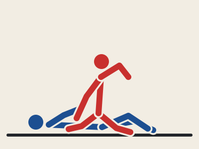

**Good for:** Full weight on their chest, both of your hands free. Ground-and-pound headquarters — and the armbar, arm triangle and americana all start here.

### Side Control

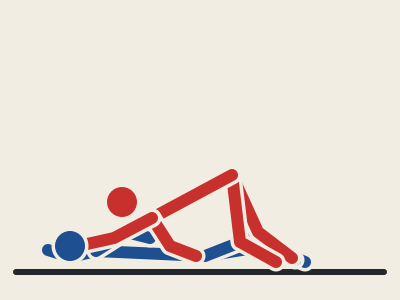

**Good for:** The heavy pin after every pass. Shoulder pressure kills their frames; the americana, arm triangle, and the hop to knee-on-belly or mount are one beat away.

### Back Control

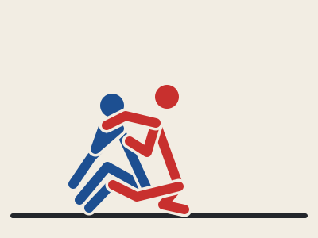

**Good for:** The best position in MMA: you can hit them, they cannot hit you back, and the rear-naked choke owns the highest finish rate in the sport.

### Knee-on-Belly

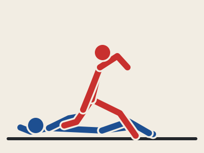

**Good for:** A pin that makes them panic. Their push on your knee feeds the armbar and the spin to mount, and your posture stays free to strike.

### North–South

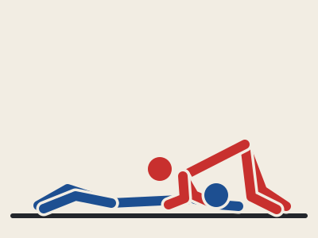

**Good for:** The pin that catches scrambles. It blocks re-guarding, feeds the north–south choke and kimura, and rotates out to side control on either side.

### Attacking the Turtle

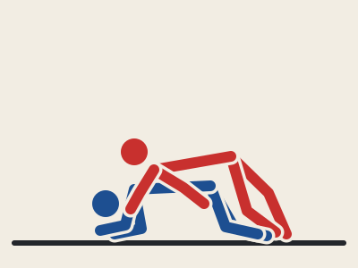

**Good for:** Where opponents hide after a sprawl or stuffed shot. Go behind to take the back, or thread the anaconda and D’Arce when they stay down.

### Closed Guard

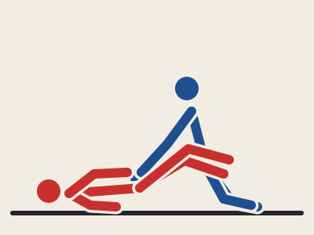

**Good for:** Your bottom safety net. Broken posture kills their punches, and the armbar, triangle, kimura and hip-bump sweep all come off the same sit-up grips.

### Half Guard

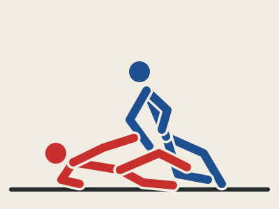

**Good for:** The MMA workhorse. Knee shield and underhook keep strikes off you while the wrestle-up and old-school sweep put you back on your feet or on top.

### Butterfly Guard

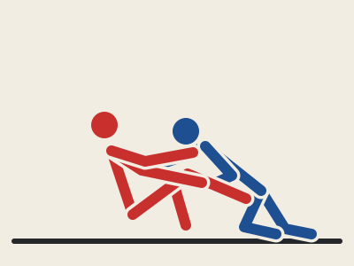

**Good for:** The seated engine against a kneeling opponent: hooks lift them into sweeps, wrestle-ups and guillotines while your hips stay off the fence.

### Front Headlock

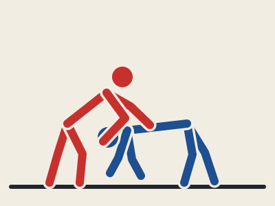

**Good for:** MMA’s choke hub. Every snap-down and every sprawl lands here — leave with a guillotine, D’Arce or anaconda, or spin behind to the back.

### The full position atlas

Every named position in jiu-jitsu, both sides of it, and the sessions where this camp visits it. A dash means it waits for a future camp.

**Top pins**

| # | Position | Sessions | Top side · bottom side |
|---|---|---|---|
| 01 | **Mount** | S1, S21–22, S25 | top: GnP, arm triangle, armbar · bottom: trap-and-roll, elbow escape |
| 02 | **High mount / S-mount** | S21 | arms trapped above the shoulders, armbar gateway · bottom: bridge early, never late |
| 03 | **Technical mount** | S21 | they turn under your mount · back door: slide straight to back control |
| 04 | **Side control** | S2, S10, S26 | top: cross-face, americana, hop to mount · bottom: frame, shrimp, underhook out |
| 05 | **Scarf hold (kesa)** | — | head-and-arm sit-out pin; heavy but loose hips give up the back — use it short |
| 06 | **North–south** | S7, S12, S24 | top: N–S choke, kimura · bottom: frame the hips, spin out to turtle |
| 07 | **Knee-on-belly** | S4, S12, S26 | top: strikes, armbar off their push · bottom: frame knee and hip, long shrimp |

**Back & turtle**

| # | Position | Sessions | Top side · bottom side |
|---|---|---|---|
| 08 | **Back control** | S3, S19, S27 | seat belt + hooks: RNC · bottom: chin down, win the hands, slide to the open side |
| 09 | **Body triangle** | S19 | trade hooks for a leg figure-four — heavier control, same choke |
| 10 | **Turtle (riding it)** | S7, S16, S20 | spiral ride, snap them flat, hooks in · underneath: elbows in, sit-out, stand |
| 11 | **Crucifix** | — | turtle side-ride with both arms trapped — strikes and RNC with zero reply |
| 12 | **The truck** | — | back-side leg ride; twister and calf-slicer country in sport rules |
| 13 | **Front headlock** | S17–20, S26 | chin strap + elbow, the choke hub · underneath: hand to throat, circle, re-wrestle |

**Fight-ready guards**

| # | Position | Sessions | Top side · bottom side |
|---|---|---|---|
| 14 | **Closed guard** | S9, S11, S23 | break posture: hip bump, kimura, armbar, triangle · vs: posture, stack, stand to open |
| 15 | **Half guard (knee shield)** | S6, S16 | underhook wrestle-up, old-school · vs: cross-face, flatten, free the knee |
| 16 | **Deep half** | — | under their hips, sweeps everywhere; thin answer to strikes — sport-first tool |
| 17 | **Lockdown half** | — | leg vice; whip-up to the dogfight and the electric-chair sweep |
| 18 | **Butterfly** | S13, S27 | hooks lift: sweeps and wrestle-ups · vs: chest heavy, kill the hooks, bodylock pass |
| 19 | **Open / seated guard** | S13, S15 | distance manager: feet on hips, arm drags · vs: toreando past the feet |
| 20 | **Rubber guard** | — | overhook + high leg traps posture under strikes; gogoplata and sweep lines |

**Sport & gi guards**

| # | Position | Sessions | Top side · bottom side |
|---|---|---|---|
| 21 | **De La Riva** | — | outside hook behind their knee; berimbolo and back takes in the gi |
| 22 | **Reverse De La Riva** | — | inside-hook answer to the knee cut; spins under to the back |
| 23 | **Spider guard** | — | gi only: sleeve grips + feet on the biceps; triangles and balance breaks |
| 24 | **Lasso guard** | — | gi only: leg threaded through the sleeve arm; omoplata factory |
| 25 | **Lapel guards** | — | gi only: worm and squid lines — lapel wraps that anchor sweeps |
| 26 | **K-guard** | — | knee wedge + ankle grip; the modern gateway into the legs |

**Leg entanglements**

| # | Position | Sessions | Top side · bottom side |
|---|---|---|---|
| 27 | **X-guard** | — | both hooks under one leg; off-balance everything, stand up into sweeps |
| 28 | **Single-leg X (ashi)** | S24 | inside hook, foot on the hip: straight-ankle home base and wrestle-ups |
| 29 | **50/50** | — | mirror-image entanglement; sport heel-hook territory — defense only in this camp |
| 30 | **Outside ashi** | — | outside heel-hook line; know the escapes before you ever chase the entries |
| 31 | **Saddle (inside sankaku)** | — | inside heel-hook control, the deepest water — defense study only |

**MMA specials**

| # | Position | Sessions | Top side · bottom side |
|---|---|---|---|
| 32 | **Wall clinch / fence seat** | S5, S15, S26 | the MMA-only battleground: underhooks, wall walks and stand-ups win rounds |
| 33 | **Dogfight** | S16 | half-guard wrestle-up standoff: whizzer vs underhook, race to the hips |

## Takedown game

### Double Leg

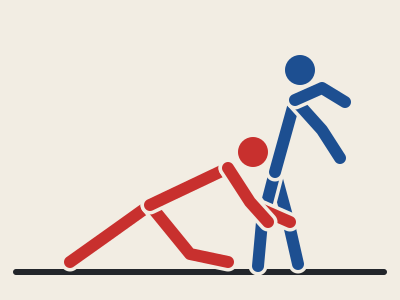

**Good for:** The highest-percentage takedown in MMA. Hide the level change behind punches; finish by driving through, lifting, or cutting the corner.

### Single Leg

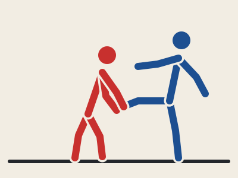

**Good for:** The shot that is always half-available: head tight, their leg to your chest, run the pipe. Also the finish for every kick you catch.

### Bodylock

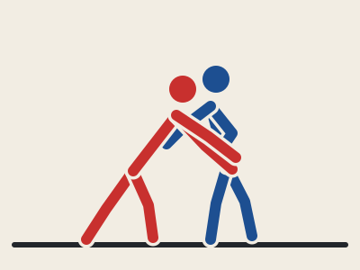

**Good for:** The cage-wrestling king. Chest to chest with your hips lower than theirs, it trades almost no guillotine risk for trips, lifts and wall takedowns.

### Sprawl

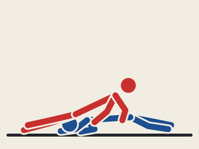

**Good for:** The anti-shot: hips crush down, legs shoot back, chest stays heavy — and their failed shot becomes your front headlock.

### Full 12-takedown syllabus

| # | Takedown | Sessions | Key detail |
|---|---|---|---|
| 01 | **Double leg** | S1, S25 | penetration step, head outside, three finishes |
| 02 | **Single leg** | S3, S21 | head inside, run the pipe; chain off the double |
| 03 | **Bodylock** | S9, S22 | over-under pummel, lift-and-turn |
| 04 | **Hip toss** | S14 | over-under entry, hips lower and through — pads only |
| 05 | **Foot sweep** | S12, S24 | de-ashi timing as their foot lands |
| 06 | **Inside trip** | S11, S22 | deep step, inside hook, drive over the trapped foot |
| 07 | **Outside trip** | S10, S22 | load the heel from the bodylock, chop and drive |
| 08 | **Knee tap** | S13, S26 | block the far knee off the over-under, drive across |
| 09 | **Ankle pick** | S7, S23 | snap them over the lead foot, scoop the heel |
| 10 | **Snap-down** | S5, S17, S20 | collar tie + elbow, snap into the chin strap |
| 11 | **Duck-under** | S6, S19 | lift the elbow, level change through, chest to back |
| 12 | **Cage takedowns** | S15, S26, S30 | wall bodylock, fence single, hip bump off the cage |

## The choke map

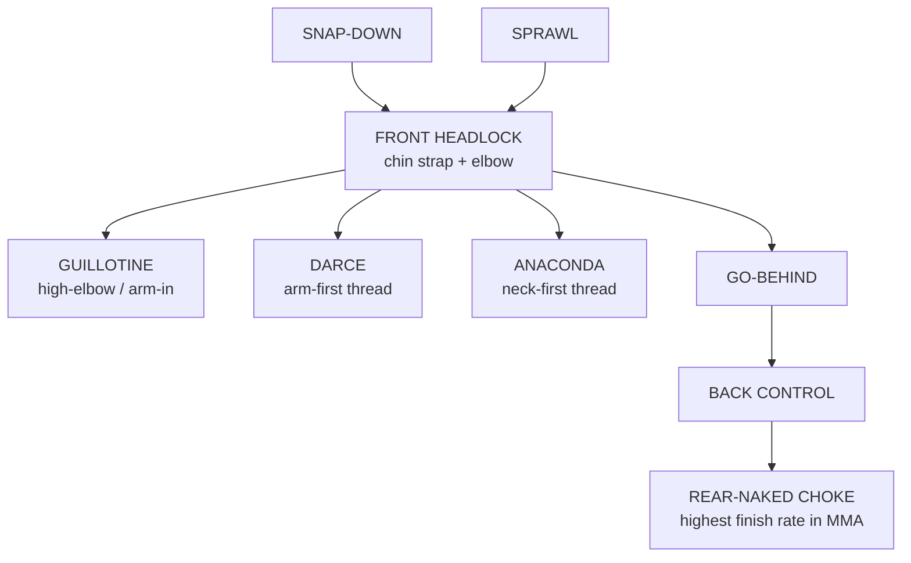

## Week 1 — SURVIVE: Don’t drown

Job one: become hard to finish. Escapes from every bad position, submission defense, and your first takedown mechanics.

### Session 01 — Day One: Base & the Upa

- **0–6 Warm-up:** Line drills: shrimp, bridge, technical stand-up, sprawl walk.
- **6–18 Takedown:** Double leg part 1 — stance and penetration step: level change with the knees, lead knee over the toes, head up. 10 clean shots each side on pads.
- **18–33 Position:** Mount escape — trap & roll: trap the arm and the same-side foot, bridge high over that shoulder, finish on top inside their guard. Both sides.
- **33–48 Submission:** RNC survival: chin down, shoulders shrugged, two-on-one on the choking hand, peel and slide it over your head. Partner builds to a 70% grip.
- **48–58 Live:** Positional 5×2 min: start mounted — escape resets, top holds or advances.
- **Coach cue:** *Bridge into them, not just up.*

### Session 02 — Frames & Sprawls

- **0–6 Warm-up:** Sprawl ladder, hip escapes down the mat, backward rolls.
- **6–18 Takedown:** Sprawl: hips punch the mat, legs shoot back, chest heavy on their shoulders, angle behind. Partner shoots at 50%.
- **18–33 Position:** Side control escape: forearm frame at the neck, elbow-to-knee connection, big shrimp, knee inside, recover guard. Option two: underhook and come up.
- **33–48 Submission:** Guillotine defense: early hand to your own throat, chin buried, shoulder pressure over the top, circle to the trapped-arm side and pop the head out.
- **48–58 Live:** 5×2 min: start under side control.
- **Coach cue:** *Frames before force — bones hold, muscles fail.*

### Session 03 — Lose the Backpack

- **0–6 Warm-up:** Seat-belt pummels, wall sits, light wrestler’s bridges.
- **6–18 Takedown:** Single leg part 1: snap the collar tie, change level, head tight to their chest, run the pipe. Counter for the partner: whizzer plus hips back.
- **18–33 Position:** Back escape: chin down, two hands win the choking hand, shoulders flat to the mat, walk the hips to the open side, clear the hook, turn in.
- **33–48 Submission:** Kimura and americana defense: hide the wrist — grab your own hip or straighten the arm — elbows tight to the ribs, turn toward the crank.
- **48–58 Live:** Back-attack rounds 4×2 min from the seat belt.
- **Coach cue:** *Chin buys time, hands buy freedom.*

### Session 04 — Bad Day at the Office

- **0–6 Warm-up:** Partner sprawl-shot ladder, easy pace.
- **6–18 Takedown:** Shot vs sprawl game: alternate on the whistle every 30 seconds at 60%. Shooters score on a clean knee pick-up.
- **18–33 Position:** Knee-on-belly escape: frame the knee and the hip, long shrimp to guard. Turtle recovery: sit-out and face them before they attach.
- **33–48 Submission:** Defense circuit, one-minute stations: RNC peel, guillotine posture, kimura hide, early armbar clasp and stack.
- **48–58 Live:** Bad-spot rotation 4×2 min: mount, side, back, KOB.
- **Coach cue:** *Position before panic — breathe, frame, move.*

> **CHECKPOINT W1 — Escape mount and side control against 50% resistance inside 60 seconds each; 10 clean penetration steps without dropping your head.**

## Week 2 — SURVIVE: Get up, get out

Guard retention, getting off the floor, and getting off the fence. The bottom is a place you visit, never live.

### Session 05 — Stand-Up Game

- **0–6 Warm-up:** Technical stand-ups on the whistle, wall sits, shot-defense footwork.
- **6–18 Takedown:** Snap-down: heavy collar tie plus elbow control, snap as they step in, circle toward the go-behind.
- **18–33 Position:** Technical stand-up and the wall walk: post, base leg back, stand facing them. On the fence: back flat, underhooks, wedge a leg, slide up — never turn away.
- **33–48 Submission:** Triangle defense: posture tall, arms both in or both out — never one-and-one. Late: stack high over their shoulder and walk around.
- **48–58 Live:** Wall rounds 5×2 min: attacker pins to the fence, defender stands and exits.
- **Coach cue:** *Head above their head, hips off the fence.*

### Session 06 — Half Shield

- **0–6 Warm-up:** Knee-shield sit-throughs, hip switches.
- **6–18 Takedown:** Duck-under: lift their elbow off the collar tie, level change through the window, chest to their back, finish with a rear bodylock.
- **18–33 Position:** Half guard bottom: knee shield and frames; the law of the position — underhook or knee shield at all times. Today: recover full guard.
- **33–48 Submission:** Arm-triangle defense: chin and hand-fight before it locks; once locked, bridge, turn belly-down toward them, make the gap and slide out.
- **48–58 Live:** Half guard bottom survival 5×2 min: recover or stand to reset.
- **Coach cue:** *Underhook or knee shield — never neither.*

### Session 07 — Land Mines & Leg Locks

- **0–6 Warm-up:** Technical stand-ups, backward rolls, ankle mobility.
- **6–18 Takedown:** Ankle pick: snap their posture over the lead foot, drop step, scoop the heel, drive through the shoulder.
- **18–33 Position:** North–south escape: frame the hips, spin inside to turtle, sit out to face them. Turtle rules: elbows in, hands guard the neck, never flatten.
- **33–48 Submission:** Leg-lock survival: straight ankle — clear the knee line, put the boot on, stand through. Heel hooks: defense concepts only, hands follow early, kill the rotation, tap at the first sign. Never applied live in this program.
- **48–58 Live:** Leg-entanglement escapes at 50%, then north–south and turtle positionals.
- **Coach cue:** *Leg tangled? Clear the knee line, then stand.*

### Session 08 — Survival Final

- **0–6 Warm-up:** Full escape flow both sides, zero resistance.
- **6–18 Takedown:** Carousel, 2-minute stations at 60%: double, single, sprawl, snap-down, duck-under, ankle pick.
- **18–33 Position:** Escape gauntlet: coach calls a new bad position every 90 seconds; escape or stand.
- **33–48 Submission:** Defense gauntlet: partner attacks the called submission at 70%; defend, escape, reset.
- **48–58 Live:** Week-2 test: 4×2 min in mount, side, back and KOB against fresh partners at 70%.
- **Coach cue:** *Calm is a skill — exhale on the bottom.*

> **CHECKPOINT W2 — Survive two minutes in any bad spot at 70% pressure without tapping; three clean wall stand-ups in one round.**

## Week 3 — CONTROL: Win every exchange

Sweeps that put you on top, passes that keep you there, and full takedowns. Position pays the bills.

### Session 09 — Bodylock & Hip Bump

- **0–6 Warm-up:** Pummeling swims, hip-heist sit-ups.
- **6–18 Takedown:** Bodylock takedown: win the over-under pummel, hips in and lower than theirs, lock behind their back, chest drive, step across, turn them over the hip.
- **18–33 Position:** Hip bump sweep: as they posture up in your closed guard — sit up big, post the hand, swing your hips over the trapped arm, land in mount.
- **33–48 Submission:** Kimura from guard: they post on the mat to stop the bump — wrap the posting arm, lock the figure-four, hip out, paint their knuckles to the ceiling.
- **48–58 Live:** Guard battle 5×2 min: bottom sweeps or submits, top postures and passes.
- **Coach cue:** *The hip bump and the kimura are the same sit-up.*

### Session 10 — Knee Cut Day

- **0–6 Warm-up:** Knee-cut slide drills down the mat, cross-face drills.
- **6–18 Takedown:** Outside trip from the bodylock: load their weight over one heel, chop the calf, chest through, land straight into side control.
- **18–33 Position:** Knee cut pass: knee slices across their bottom shin, far-side underhook, heavy cross-face, corkscrew the hips through to side control.
- **33–48 Submission:** Americana from side control: they push up — pin the wrist to the mat, figure-four, paint the knuckles toward their hip, lift the elbow.
- **48–58 Live:** Pass vs guard 5×2 min from open guard.
- **Coach cue:** *The cross-face wins the pass before the knee does.*

### Session 11 — Scissor & Straight Arm

- **0–6 Warm-up:** Scissor-sweep load-ups, hip-escape flow.
- **6–18 Takedown:** Inside trip: off the collar tie, deep step between their feet, inside hook the lead leg, drive over the trapped foot.
- **18–33 Position:** Scissor sweep: wrist and head control, knee across their chest, bottom leg chops the base, pull them onto you first — no load, no sweep.
- **33–48 Submission:** Armbar from guard: control the wrist, climb the legs high to the armpits, cut the angle, knees pinch, leg over the face, lift the hips.
- **48–58 Live:** Sweep-or-pass 5×2 min.
- **Coach cue:** *Nobody sweeps a tall opponent — break the posture first.*

### Session 12 — Toreando & Tempo

- **0–6 Warm-up:** Push-pull partner steps, foot-sweep timing.
- **6–18 Takedown:** Foot sweep: pull them into a step and sweep the ankle with your arch just as the foot lands; the hands snap them past you.
- **18–33 Position:** Toreando pass: control both shins, steer the legs one way and step the other, hip switch into knee-on-belly before they turn in.
- **33–48 Submission:** Kimura from north–south and side: snag the far wrist as they push, figure-four, rotate toward the head, their elbow glued to your chest.
- **48–58 Live:** Positional carousel 5×2 min: guard, pass, KOB.
- **Coach cue:** *Pass to knee-on-belly, not into a hug.*

> **CHECKPOINT W3 — Hit two different sweeps and one clean pass against 60% resistance; finish the bodylock takedown into side control.**

## Week 4 — CONTROL: Cage & chains

Butterfly attacks, wrestle-ups, pressure passing and the fence game — where most MMA grappling actually happens.

### Session 13 — Butterfly Engine

- **0–6 Warm-up:** Seated hip movement, butterfly sit-and-lift drills.
- **6–18 Takedown:** Knee tap: off the over-under, block the far knee, drive across the block, head up and chest heavy.
- **18–33 Position:** Butterfly hook sweep: chest to chest, underhook plus far-arm control, load them onto your hooks, lift the underhook-side hook, roll them over the trapped arm.
- **33–48 Submission:** High-elbow guillotine intro: when they duck or shoot lazy — chin strap, wrist blade on the throat, elbow climbs over their back, hips curl in.
- **48–58 Live:** Seated starts 5×2 min: butterfly vs kneeling passer.
- **Coach cue:** *Hooks do nothing without chest-to-chest.*

### Session 14 — Heavy Hips

- **0–6 Warm-up:** Hip-toss footwork with no throw, crash-pad falls.
- **6–18 Takedown:** Hip toss from the over-under: step across, hips lower than theirs and through, rotate them over. Soft throws onto pads only.
- **18–33 Position:** Bodylock pressure pass: lock over their knees, chest heavy, walk the hips to one side, slide the knee over — your chest never leaves them.
- **33–48 Submission:** Arm triangle from mount: pin their arm across the neck, drop your head to that side, slide off to the other, hips low, squeeze slow.
- **48–58 Live:** Top-pressure rounds: pass, hold five seconds, advance to mount.
- **Coach cue:** *Pressure is patience with posture.*

### Session 15 — Fence Wrestling 101

- **0–6 Warm-up:** Wall sits, wall-pummel entries.
- **6–18 Takedown:** Cage takedowns: stuffed double becomes a wall bodylock; head inside, inside trip and run-the-pipe single off the fence.
- **18–33 Position:** Wall play both sides — pinner: head under the chin, hips glued, wrist rides; defender: frame, swim, circle off, never flat. Arm drag to the back at the wall.
- **33–48 Submission:** RNC mechanics: choking arm deep past the chin, elbow centered under the jaw, second hand behind the head, squeeze chest-to-spine. Catch and release.
- **48–58 Live:** Cage rounds 5×2 min: takedown vs stand-up on the fence.
- **Coach cue:** *On the fence, head position is the whole fight.*

### Session 16 — Half Guard, Both Chairs

- **0–6 Warm-up:** Underhook sit-outs, old-school entries, no resistance.
- **6–18 Takedown:** Chain drill at 60%: double → knee tap → bodylock, flowing off the partner’s reactions.
- **18–33 Position:** Split rounds. Bottom: old-school — deep underhook, up on the elbow, capture the far ankle, drive over it; sprawled on? Treat it as a single leg. Top: half-guard pass — cross-face, far underhook, flatten them, free the knee with a toe grab.
- **33–48 Submission:** Turtle attacks: seat belt, chair-sit to hooks, snap them flat — finish the sequence with a catch-and-release RNC.
- **48–58 Live:** Half guard top/bottom 5×2 min, then the week-4 sweep test.
- **Coach cue:** *The underhook is the steering wheel — whoever has it, drives.*

> **CHECKPOINT W4 — Sweep or wrestle up from bottom half or butterfly inside 90 seconds; defend a cage takedown and exit off the fence.**

## Week 5 — FINISH: The choke hub

The front headlock is MMA’s money position. Enter it from snap-downs and sprawls; leave with a neck or the back. Open-hand placement strikes appear this week.

### Session 17 — Front Headlock Day

- **0–6 Warm-up:** Snap-down footwork, chin-strap pummels.
- **6–18 Takedown:** Snap-down to front headlock: heavy collar tie and elbow, snap as they step, chin strap plus elbow control before their hands touch the mat.
- **18–33 Position:** Front headlock ride: chest on the crown, chin strap, second hand rides the elbow, knee blocks the near shoulder, spin opposite their sit-out.
- **33–48 Submission:** High-elbow guillotine, full detail: chin strap deep, blade on the throat, clasp without weaving, elbow climbs over the back, hips curl through. Finish standing or with guard on one side.
- **48–58 Live:** Front headlock spar 5×2 min: finish or escape resets.
- **Coach cue:** *Chin strap first, choke second.*

### Session 18 — The D’Arce

- **0–6 Warm-up:** Sprawl flow, shot entries at 50%.
- **6–18 Takedown:** Sprawl to front headlock: their shot comes in, hips crush down, chin strap installs on the way up.
- **18–33 Position:** Go-behind: shuck the head down and past, drag the elbow, chest glued, arrive at a 90-degree angle behind them.
- **33–48 Submission:** D’Arce — the arm-first entry: thread under their near arm and across the neck, palm to your own biceps, second hand behind their head, shrink the circle. Hit it off half guard top and stuffed shots.
- **48–58 Live:** Sprawl-and-brawl grappling: one shoots, one snaps and chokes.
- **Coach cue:** *They fight the guillotine hand? The D’Arce is already there.*

### Session 19 — Take the Back

- **0–6 Warm-up:** Seat-belt pummels, hook retention drills.
- **6–18 Takedown:** Duck-under to the back, rear bodylock finish: lift, angle, place them down — mat returns, never spikes.
- **18–33 Position:** Back retention: seat belt palm-over-palm on the chest, hooks or body triangle, follow their turn like a backpack, re-pummel lost hooks.
- **33–48 Submission:** RNC against full resistance: trap one wrist one-on-one, sneak the choking hand while they fight, palm-to-palm short choke when the full lock is blocked.
- **48–58 Live:** Back attack vs escape 5×2 min.
- **Coach cue:** *Legs keep the position, hands take the neck.*

### Session 20 — Anaconda & the Map

- **0–6 Warm-up:** Front-headlock flow with a partner, both sides.
- **6–18 Takedown:** Snap-down variations: two-on-one snap, inside-tie snap, cross-face snap — every snap finishes in a chin strap.
- **18–33 Position:** Choke-map flow drill: snap → front headlock → coach calls the exit — guillotine, D’Arce, anaconda or go-behind. Ten reps per pair.
- **33–48 Submission:** Anaconda — the neck-first entry: thread under the neck and out the far armpit, biceps grip, gator-roll toward the trapped arm to shrink it. Knees to chest, breathe them out.
- **48–58 Live:** Front-headlock-only game 5×2 min.
- **Coach cue:** *Neck-first is anaconda, arm-first is D’Arce.*

> **CHECKPOINT W5 — From a snap-down: enter the front headlock and finish one choke (guillotine, D’Arce or anaconda) or take the back, against a resisting partner.**

## Week 6 — FINISH: Mount, triangles & legs

Finish from the positions you win: the mount and back systems, the armbar–triangle guard engine, and one safe leg attack.

### Session 21 — Mount Week Opens

- **0–6 Warm-up:** Grapevine holds, tech-mount switches.
- **6–18 Takedown:** Double–single chain: shoot the double; they sprawl a leg free — swing to the single and run the pipe.
- **18–33 Position:** Mount maintenance: grapevines, head under the chin; they turn, you tech-mount; they push, your hands ride up. Thirty-second king-of-mount turns.
- **33–48 Submission:** Armbar from mount: they push your chest — S-mount, knee behind the head, leg over the face, fall back slow, knees pinched, thumb up.
- **48–58 Live:** Mount attack vs escape 5×2 min.
- **Coach cue:** *When they push, they hand you the arm.*

### Session 22 — Head & Arm

- **0–6 Warm-up:** Pummeling, trip entries at 50%.
- **6–18 Takedown:** Bodylock to trips: inside trip when they base back, outside trip when they lean in — feel it, don’t force it.
- **18–33 Position:** Pressure pass to mount: slide the knee over the belt line, grapevine, consolidate before you climb.
- **33–48 Submission:** Arm triangle system: punch the arm across from mount, head drops, slide off toward the trapped-arm side, hips low, squeeze slow. Fist in the way? Fix the angle, not the effort.
- **48–58 Live:** Pass-to-submission rounds: a sub only counts if you held the position three seconds first.
- **Coach cue:** *Squeeze like a door closing, not a trap snapping.*

### Session 23 — Triangle Day

- **0–6 Warm-up:** High-leg climbs, hip-up holds, angle-cut drills.
- **6–18 Takedown:** Ankle pick review plus snap-down mix: make them carry your collar-tie weight, then pick the lead ankle.
- **18–33 Position:** Guard attack posture: overhook and head control, climb the legs to the armpits, hips never flat — the punch-safe angles.
- **33–48 Submission:** Triangle from guard: one arm in, one arm out, shoot the legs high, lock the shin behind the knee, cut perpendicular, curl their head down. Chain: armbar when they pull out, triangle when they re-post.
- **48–58 Live:** Guard submission-only rounds 5×2 min.
- **Coach cue:** *No angle, no triangle — get perpendicular.*

### Session 24 — Below the Belt, Safely

- **0–6 Warm-up:** Ashi entries on a cooperative partner.
- **6–18 Takedown:** Foot sweep and snap rhythm: sweep when they defend the snap, snap when they defend the sweep.
- **18–33 Position:** North–south control and rotations: side → north–south → far side, chest heavy, hips never float.
- **33–48 Submission:** North–south choke: arm past the neck, shoulder drops onto the throat, hips low, slow squeeze. Straight ankle: ashi position, knees pinch, blade under the achilles, hips forward — no twisting, instant release. Heel-hook defense review only.
- **48–58 Live:** Submission-only rounds; every leg attack is catch-and-release. Week-6 chain test.
- **Coach cue:** *Catches prove control; control proves the finish.*

> **CHECKPOINT W6 — Chain three submissions in one continuous catch-and-release sequence from mount or guard; finish a straight ankle lock with control.**

## Week 7 — FIGHT: Add the strikes

Everything now happens under light strikes: ground-and-pound on top and bottom, striking-aware guard, cage MMA rounds. Gloves on, 30% maximum.

### Session 25 — Ground & Pound 101

- **0–6 Warm-up:** Glove up; shadow wrestling with level changes.
- **6–18 Takedown:** Double leg off the jab: hide the level change behind your own punches, shoot as their weight loads the lead leg.
- **18–33 Position:** GnP from mount and guard top at 30%: base first, punch second — posture control, hand traps, short elbows. Bottom player installs the high-frame punch block.
- **33–48 Submission:** Arm triangle off their punch: the bottom player swings, the arm crosses the center line — pin it, drop the head, lock the choke.
- **48–58 Live:** MMA positional 5×2 min: top may strike light; bottom escapes or submits.
- **Coach cue:** *Strike to advance, not just to score.*

### Session 26 — Fence & Fists

- **0–6 Warm-up:** Wall pummeling with gloves, light inside shots.
- **6–18 Takedown:** Cage wrestling with strikes: level change off short punches, knee taps at the wall, bodylock with the head inside, light knees to the thighs.
- **18–33 Position:** GnP from side control and knee-on-belly: shoulder pressure, short elbows, hop to KOB to open the punches. Defender: frames up, wall-walks under fire.
- **33–48 Submission:** Guillotine punishing the shot: they duck in off your punches — snap, chin strap, high elbow. Their takedown becomes your finish.
- **48–58 Live:** Cage MMA rounds 5×2 min, light.
- **Coach cue:** *Position pays for the punches.*

### Session 27 — Bottom Game Under Fire

- **0–6 Warm-up:** Punch-block series flow: frame, hip escape, knees in.
- **6–18 Takedown:** Level change off strike feints; defenders sprawl on the real one — read the hips, not the hands.
- **18–33 Position:** Punch-block series to attacks: high frame, hip escape, butterfly lift to wrestle-up; break their posture by pulling the punching arm in.
- **33–48 Submission:** RNC in scrambles: every time they turn away from punches — seat belt, hooks, finish. Back takes off every turn.
- **48–58 Live:** Scramble-heavy MMA rounds, light: coach resets to chaos positions.
- **Coach cue:** *The arm they punch with is the arm you take.*

### Session 28 — Rounds

- **0–6 Warm-up:** Jump rope, sprawl bursts, breathing drills.
- **6–18 Takedown:** Chain wrestling tired: 45-second bursts of double → single → bodylock against sprawl and light strikes.
- **18–33 Position:** Fight-IQ drill: from any position the coach calls advance, strike, finish or stand — three seconds to obey.
- **33–48 Submission:** Choke map under fatigue: 30-second sprawl sprint, then run the map on a resisting partner.
- **48–58 Live:** 1×5 min full fight sim, light strikes.
- **Coach cue:** *Score with position, rest in control, finish on their exhale.*

> **CHECKPOINT W7 — In one 5-minute fight sim: land a takedown, advance one position, threaten one submission, and stand back up under light fire.**

## Week 8 — FIGHT: Peak week

Sharpen, rehearse, taper, test. Nothing new this week — everything faster, cleaner, calmer.

### Session 29 — Sharpen

- **0–6 Warm-up:** Fast feet, level changes, two sprawls, roll out.
- **6–18 Takedown:** Speed chains: six takedowns for time, both sides, crisp entries — sloppy reps reset the clock.
- **18–33 Position:** Top flow: pass → knee-on-belly → mount → back with light GnP against rising resistance.
- **33–48 Submission:** Chain carousel, catch-and-release: armbar–triangle–kimura from guard; guillotine–D’Arce–anaconda from the front headlock.
- **48–58 Live:** 2×3 min fight sims, light.
- **Coach cue:** *Speed is certainty, not hurry.*

### Session 30 — Dress Rehearsal

- **0–6 Warm-up:** Full fight warm-up exactly as on fight night.
- **6–18 Takedown:** Cage takedowns and defense, mixed rounds at fight pace, light strikes.
- **18–33 Position:** Wall stand-ups under fire, GnP against the cage, referee-position restarts.
- **33–48 Submission:** Finish what appears: coach calls a position, you take the highest-percentage submission available inside 20 seconds.
- **48–58 Live:** 3×3 min fight sim with corner advice between rounds.
- **Coach cue:** *Fight the plan, not your feelings.*

### Session 31 — Taper & Flow

- **0–6 Warm-up:** Easy movement, long exhales.
- **6–18 Takedown:** Shadow wrestling; 50% entries on a cooperative partner — footwork perfect, breathing quiet.
- **18–33 Position:** Flow rolls: continuous position-to-position at 50%, no winners today.
- **33–48 Submission:** Catch-and-release chains at 50%; talk the choke map and the ladder out loud with your partner.
- **48–58 Live:** 2×3 min conversational-pace flow spars.
- **Coach cue:** *Store it today, spend it Saturday.*

### Session 32 — FINAL EXAM

- **0–6 Warm-up:** Fighter’s choice, six minutes.
- **6–18 Takedown:** Land three different takedowns against 70% defense — one of them against the cage.
- **18–33 Position:** Escape mount, side control and back control at 70%; two wall stand-ups under pressure.
- **33–48 Submission:** Run the full choke map, then chain three submissions catch-and-release without losing position.
- **48–58 Live:** One 5-minute championship-pace fight sim, light strikes. Debrief and scorecard.
- **Coach cue:** *Empty the toolbox.*

> **FINAL — Pass the fight-ready checklist below. Coach signs off line by line.**

## Fight-ready checklist (Session 32 final exam)

- [ ] Three takedowns landed on a resisting opponent — at least one against the cage
- [ ] Escapes shown from mount, side control and back control at 70% intensity
- [ ] Two wall stand-ups under pressure in a single round
- [ ] Choke map run end to end: snap-down, front headlock, finish or back take
- [ ] Three submissions chained catch-and-release without losing position
- [ ] Sweep or wrestle-up from half or butterfly guard inside 90 seconds
- [ ] 5-minute fight sim: takedown + position advance + submission threat + stand-up
- [ ] Composure under light strikes — taps early, releases instantly, coach sign-off

---

*Tap early. Train tomorrow.*
